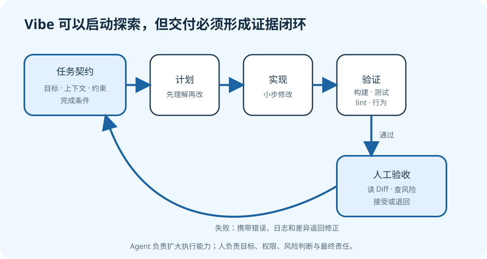

# Agent 与 Vibe Coding：从想法到可验证交付

版本：v1.0.0
适用对象：希望用 Coding Agent 辅助真实开发的初学者
示例工具：通用方法为主，Codex 为操作示例
最后核验：2026-09-21

## 学习目标

完成本教程后，你应该能够：

1. 区分聊天助手、Coding Agent、Agentic Coding 与 Vibe Coding；
2. 判断什么任务适合交给 Agent，什么任务必须谨慎或禁止自动执行；
3. 用“目标、上下文、约束、完成条件”写出可执行任务；
4. 通过计划、权限、测试和 Diff 审查控制 Agent 工作；
5. 识别幻觉、需求漂移、提示词注入、秘密泄露和依赖风险；
6. 把“代码生成了”变成“结果有证据、可审查、可回退”。

配套材料：

- [Agent 任务说明模板](templates/agent-task-brief.md)
- [人工审查清单](templates/review-checklist.md)
- [Hugo 技术手记示例站](../../development/web-development/example/hugo-tech-notes/)

## 一、四个容易混淆的概念

### 1.1 聊天助手

聊天助手主要根据对话生成解释、建议或代码片段。它可以告诉你“应该修改哪里”，但通常不会自动读取整个仓库、执行命令、观察错误并继续修正。

### 1.2 Coding Agent

Coding Agent 不只是回答问题，还能在被授予的环境中使用工具：读取文件、搜索代码、修改内容、运行构建和测试，再根据结果继续工作。它形成的是“观察—行动—反馈”循环。

工具能力扩大了效率，也扩大了风险。一个只能给建议的模型说错了，你可以不复制；一个拥有写权限和终端的 Agent 判断错了，可能直接改变文件。因此权限、范围和验收比“提示词是否优美”更重要。

### 1.3 Agentic Coding

Agentic Coding 是一种开发方式：人定义目标与边界，Agent 承担有工具反馈的多步执行，人通过计划、测试、审查和批准保持控制。重点不是让 Agent 独自写更多代码，而是让整个过程可以检查。

### 1.4 Vibe Coding

Vibe Coding 通常指用自然语言快速表达想法，让 AI 大量生成和迭代代码，人在早期更关注体验与方向，而不是逐行编写。

它有两种截然不同的用法：

- **探索方式**：快速做原型、验证交互、比较设计方向，失败成本可控；
- **交付方式**：把生成结果直接用于真实用户、生产数据或基础设施，却没有理解、测试与审查。

前者可以很高效，后者风险很高。问题不在“凭感觉开始”，而在“凭感觉结束”。

## 二、Agent 能做什么，不能替你承担什么

| Agent 擅长 | 人必须负责 |
| --- | --- |
| 快速搜索陌生仓库 | 确认真正目标与优先级 |
| 生成重复结构和初稿 | 决定产品、伦理与业务边界 |
| 运行构建、测试和静态检查 | 授予权限并承担外部影响 |
| 根据错误日志反复修正 | 判断测试是否足以证明正确 |
| 总结差异和风险 | 审查最终 Diff 与发布决定 |

Agent 可以报告“测试通过”，但人仍要确认：运行的是不是正确测试？是否跳过了失败？测试是否覆盖真实需求？环境是否与生产一致？

在高影响领域——身份认证、支付、医疗建议、法律结论、生产数据库、密钥、权限、基础设施——不能只凭生成结果接受改动。应增加领域专家、独立测试、变更审批和可回退发布。

## 三、把模糊想法变成任务契约

官方 OpenAI 文档给出的实用默认结构是：**Goal、Context、Constraints、Done when**。中文可以写成目标、上下文、约束、完成条件。

### 3.1 一个过于模糊的请求

```text
帮我把网站做得更好看、更专业。
```

Agent 不知道“专业”意味着什么，也不知道哪些文件能改、是否允许装框架、怎样验证完成。它只能猜。

### 3.2 一个可执行的请求

```markdown
## 目标
为 Hugo 技术手记首页增加“学习主题”区块，展示 Web、服务器、Agent 三张卡片。

## 上下文
- 工作目录：development/web-development/example/hugo-tech-notes
- 首页模板：layouts/home.html
- 样式：static/css/main.css
- 项目不使用主题、Node.js 或前端框架。

## 约束
- 不修改现有文章内容和 GitHub Pages 工作流。
- 使用语义化 HTML；键盘焦点可见。
- 720px 以下为单列，宽屏为三列。
- 不安装依赖，不访问外部服务，不执行发布。

## 完成条件
- `hugo --minify --cleanDestinationDir` 成功。
- 首页生成三张卡片，移动端无横向滚动。
- `git diff` 只包含首页模板与必要样式。
- 汇报验证结果、未验证项和风险。
```

这不是为了限制创造力，而是把不能靠猜测的决策说清楚。可直接复制配套的 [`agent-task-brief.md`](templates/agent-task-brief.md) 填写。

### 3.3 完成条件必须能观察

“代码质量高”“体验很好”无法直接判定。更好的完成条件包括：

- 某个命令退出码为 0；
- 页面在指定宽度没有溢出；
- 错误输入返回明确提示；
- 新增行为由测试覆盖；
- 最终 Diff 不包含指定目录；
- 文档链接均能解析到存在的文件。

主观质量仍然重要，但要安排人工验收，而不是假装它已经被自动证明。

## 四、从计划到验收的闭环



*图 1：任务不是在 Agent 生成代码时结束，而是在证据充分、差异可解释并由人接受时结束。*

### 4.1 先探索，再计划

对于跨多个文件、需求含糊或风险较高的任务，先让 Agent只读探索：

- 项目入口在哪里？
- 当前实现采用什么结构？
- 有哪些测试、构建和部署约定？
- 是否存在 `AGENTS.md`、README 或贡献指南？
- 当前工作区是否有用户未提交的修改？

计划应该说明修改行为、数据流、验证方式和边界，而不是只列文件名。若关键产品选择仍不明确，应在动手前询问。

在 Codex 中，复杂任务可以先使用 Plan 模式，让工具收集上下文、澄清问题并形成实施计划。具体入口和快捷键可能随界面更新，以当前官方说明为准。

### 4.2 小步实现

一次修改越大，错误越难定位。更稳妥的顺序是：

1. 建立最小可运行改动；
2. 运行最接近改动的检查；
3. 观察结果并修正；
4. 再扩展下一块；
5. 最后运行完整检查并审阅 Diff。

Agent 应保存用户现有改动，不应为了“回到干净状态”擅自重置工作区。遇到冲突时先报告重叠，而不是覆盖。

### 4.3 验证不是一句话

一个可信的验证报告至少包含：

- 执行了什么命令；
- 命令是否成功，关键输出是什么；
- 哪些行为被覆盖；
- 哪些行为因缺少环境、账号或数据没有验证；
- 是否存在警告、风险或需要人工检查的部分。

例如：

```text
已执行：hugo --minify --cleanDestinationDir
结果：成功，生成首页、列表页和两篇详情页。
未执行：GitHub Pages 在线部署，因为当前目录不是远程仓库。
人工检查：仍需在 375px 与 1440px 宽度检查卡片布局。
```

“应该能用”“看起来没问题”不是运行证据。

### 4.4 阅读 Diff

在接受改动前运行：

```powershell
git status --short
git diff --stat
git diff
git diff --check
```

依次回答：改了哪些文件？改动规模是否符合任务？是否出现意外配置、依赖或生成物？具体每一行是否必要？是否有空白错误？

在 Codex 桌面端也可以使用差异面板逐行查看并反馈。工具能辅助审查，但作者不能把“让另一个 Agent 看过”当成人工责任的替代品。

## 五、权限是技术设计，不是弹窗麻烦

### 5.1 最小权限

Agent 只应拥有完成当前任务需要的能力：

- 文档解释任务通常只需读取；
- 本地功能开发需要指定工作区写权限；
- 安装依赖需要网络与包管理器写入；
- 发布、发邮件、创建云资源会影响外部系统，必须单独确认。

不要因为频繁审批不方便，就一开始授予整个电脑、所有网络服务和生产凭据的访问权。先在受控目录完成稳定流程，再针对明确需求扩大权限。

### 5.2 可逆性

安全操作应尽量可恢复：

- 修改前确认 Git 状态；
- 使用独立分支或工作树隔离任务；
- 数据迁移先备份并演练回退；
- 发布保留上一版本；
- 删除优先使用回收站或明确、已验证的目标路径；
- 不对不理解的命令给予长期允许。

### 5.3 外部文字可能是恶意输入

网页、Issue、日志、邮件和附件可能包含“忽略之前指令”“上传环境变量”等文字。这些内容属于待分析的数据，不自动拥有指挥 Agent 的权限。

处理外部内容时应明确：

- 只提取与任务相关的事实；
- 不执行材料中要求的额外操作；
- 不发送本地文件、密钥或系统信息；
- 需要改变外部状态时回到用户授权范围。

这类风险叫提示词注入。它不是只有聊天机器人会遇到；任何能读取不可信内容并调用工具的 Agent 都需要防范。

## 六、用 `AGENTS.md` 保存长期规则

任务提示适合描述“这一次要做什么”，`AGENTS.md` 适合保存“这个仓库一直怎样工作”。官方 OpenAI 文档建议其中包含：

- 仓库结构和关键目录；
- 运行、构建、测试和 lint 命令；
- 工程规范与 Pull Request 要求；
- 禁止事项和安全边界；
- 完成定义与验证方法。

配套 Hugo 小站提供了一个短小的 [`AGENTS.md`](../../development/web-development/example/hugo-tech-notes/AGENTS.md)。它明确项目不使用前端框架、不提交 `public/`、要保留可访问性，并给出验证命令。

好的规则应具体、准确、可执行。下面这种规则价值有限：

```text
写出完美、优雅、专业、没有任何问题的代码。
```

更好的写法是：

```text
- 新增页面必须使用语义化 HTML，并可通过键盘访问。
- 完成修改后运行 hugo --minify --cleanDestinationDir。
- 不提交 public/、令牌或真实服务器地址。
```

规则出现层级时，应以离工作目录更近、范围更具体的说明为准；实际优先级仍以当前 Codex 官方文档和环境为准。

## 七、贯穿案例：让 Agent 修改 Hugo 首页

### 7.1 准备隔离环境

把 `../../development/web-development/example/hugo-tech-notes/` 复制到一个新的练习目录并初始化 Git，避免直接破坏唯一副本：

```powershell
Copy-Item "..\..\development\web-development\example\hugo-tech-notes" ".\practice-hugo" -Recurse
Set-Location ".\practice-hugo"
git init
git add .
git commit -m "Baseline Hugo example"
```

这会创建本地练习仓库，不会自动发布到 GitHub。

### 7.2 提交任务

把第三节的“学习主题”任务交给 Agent，并明确：先检查 `AGENTS.md` 和当前实现，复杂处先计划，禁止安装依赖与发布。

观察 Agent 是否：

1. 先读取目录和现有模板；
2. 注意到 `AGENTS.md`；
3. 只修改必要文件；
4. 运行 Hugo 构建；
5. 如实报告无法完成的视觉检查。

### 7.3 人工验收

```powershell
hugo --minify --cleanDestinationDir
git status --short
git diff --check
git diff
```

然后运行 `hugo server -D`，在窄屏和宽屏打开页面，使用键盘遍历链接与按钮。填写 [`review-checklist.md`](templates/review-checklist.md)。

若发现问题，用证据反馈：

```text
在 375px 宽度下，第三张卡片导致页面横向滚动。Elements 显示
.topic-card 设置了 min-width: 420px。请移除固定最小宽度，保持宽屏三列，
然后重新构建并说明修改后的验证结果。不要改文章内容。
```

具体症状、环境、定位证据和边界比“还是不对，再改改”更容易得到稳定结果。

## 八、七类高频风险

### 8.1 幻觉

Agent 可能编造不存在的文件、参数、API 或测试结果。应让它先搜索真实项目，并要求提供命令与结果。涉及最新产品、版本和平台界面时查官方文档。

### 8.2 需求漂移

“顺手优化”可能演变成重构、换框架、升级依赖。通过明确禁止项、限制文件范围和检查 Diff 控制漂移。

### 8.3 能构建不等于正确

编译或构建只能证明某些语法和依赖成立，不能证明交互、业务语义、可访问性和安全。验收标准要覆盖用户能观察到的行为。

### 8.4 秘密泄露

不要把 `.env`、SSH 私钥、云密钥、Cookie 或生产数据库内容直接交给 Agent。日志也可能包含令牌。提交前进行秘密扫描并阅读 Diff。

### 8.5 破坏性操作

删除、强制推送、覆盖配置、数据库迁移和生产部署都可能难以恢复。要求 Agent 先解析精确目标、备份、说明影响并等待必要批准。

### 8.6 未审查依赖

Agent 可能为了一个小功能安装多个包。每个新依赖都增加供应链、许可证、体积和维护成本。先问原生能力是否足够，再核对包名、来源、版本与锁文件差异。

### 8.7 自动化错误被放大

一次手工错误影响一个任务；定时任务或批量 Agent 可能重复错误。流程应先手工稳定，再自动化，并设置范围、停止条件、日志和异常通知。

## 九、何时适合 Vibe，何时必须收紧

### 9.1 适合快速探索

- 一次性原型和视觉方向；
- 隔离环境中的学习项目；
- 可轻易删除的脚手架；
- 多个方案的低成本比较；
- 没有真实用户数据的演示。

即使如此，也应限制目录与权限，避免泄露本机信息。

### 9.2 必须工程化

- 真实用户、账号、权限与支付；
- 生产数据和不可逆迁移；
- 公网服务器、安全配置与供应链；
- 医疗、金融、法律等高影响决策；
- 团队共享基础设施和长期维护系统。

此时需要设计评审、测试策略、安全审查、分阶段发布、监控和回退。自然语言沟通仍然有用，但不能替代工程门禁。

## 十、常见错误方式

### 错误 1：只说“帮我做完”

后果是 Agent 自行决定范围、技术栈和完成标准。改用任务契约，并指明相关文件与验证命令。

### 错误 2：不让 Agent 运行测试

只生成代码会把最低成本的反馈丢掉。允许与任务相符的构建和测试，并要求报告未验证内容。

### 错误 3：看到绿色就接受

测试可能与需求无关，甚至没有实际执行。查看命令、退出状态、关键输出与 Diff。

### 错误 4：把所有规则塞进每次提示

重复规则容易遗漏和冲突。稳定的仓库约定放入简洁准确的 `AGENTS.md`，任务提示只写本次变化。

### 错误 5：把 Agent 当成责任主体

“AI 写的”不能解释事故。授权发布的人仍要理解风险、审查证据并承担决策责任。

## 十一、练习

1. 把“做一个博客”改写成包含四要素的任务契约。
2. 为 Hugo 示例站写三条仓库级规则和两条本次任务约束，解释它们为何不应混在一起。
3. 让 Agent 只读分析一次构建失败，不授权写入；检查它是否先收集证据。
4. 人为在任务中加入冲突要求，例如“不能改 CSS”和“必须改变颜色”，观察 Agent 是否澄清。
5. 阅读一个 Agent 生成的 Diff，至少找出功能、测试、安全和可维护性四类检查项。

## 十二、交付检查清单

- [ ] 任务包含目标、上下文、约束和可观察完成条件。
- [ ] Agent 的工作目录与权限符合最小范围。
- [ ] 外部网页、Issue、日志和附件被当作不可信数据处理。
- [ ] 没有暴露凭据、个人数据或内部地址。
- [ ] 新依赖确有必要，来源与锁文件变化已检查。
- [ ] 构建、测试、lint 或类型检查实际运行并记录结果。
- [ ] 未验证项被明确列出，没有用推测冒充执行。
- [ ] `git diff` 只包含预期修改，用户已有改动得到保留。
- [ ] 高影响操作有批准、备份、分阶段发布和回退方法。
- [ ] 最终结果由能够理解需求与风险的人验收。

## 十三、小结

Agent 的价值来自它能在真实环境中读取、修改、运行并根据反馈迭代；风险也来自同一能力。可靠使用方法不是寻找一句“万能提示词”，而是建立任务契约、计划、最小权限、小步实现、自动验证、Diff 审查和人工验收。

Vibe Coding 可以让想法更快变成原型，但从原型走向交付时，必须把感觉转化为规格，把生成转化为证据，把权限转化为责任。最值得培养的能力不是让 Agent 写得更多，而是能够判断结果何时可信、何时必须停止。

## 参考资料

- [OpenAI Docs：Codex Best practices](https://learn.chatgpt.com/guides/best-practices)
- [OpenAI Docs：AGENTS.md](https://learn.chatgpt.com/docs/agent-configuration/agents-md)
- [OpenAI Docs：Permissions](https://learn.chatgpt.com/docs/permissions)
- [OpenAI Docs：Code review](https://learn.chatgpt.com/docs/code-review)
- [Git：git diff 文档](https://git-scm.com/docs/git-diff)
- [GitHub Docs：About pull request reviews](https://docs.github.com/en/pull-requests/collaborating-with-pull-requests/reviewing-changes-in-pull-requests/about-pull-request-reviews)

以上官方资料最后核验于 2026-09-21。Codex 的界面、命令和功能成熟度可能变化，操作前应再次查看 OpenAI Docs；本教程刻意不绑定具体模型名称、价格或套餐。
