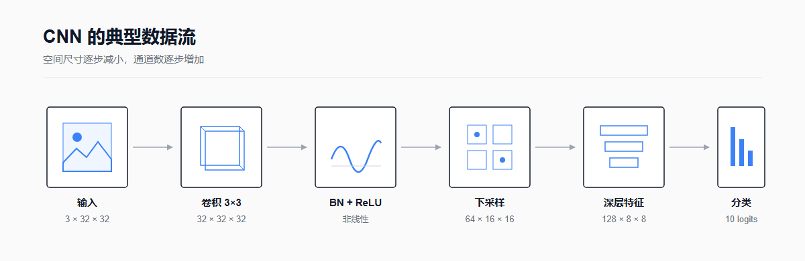
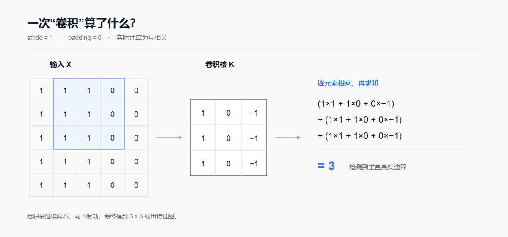
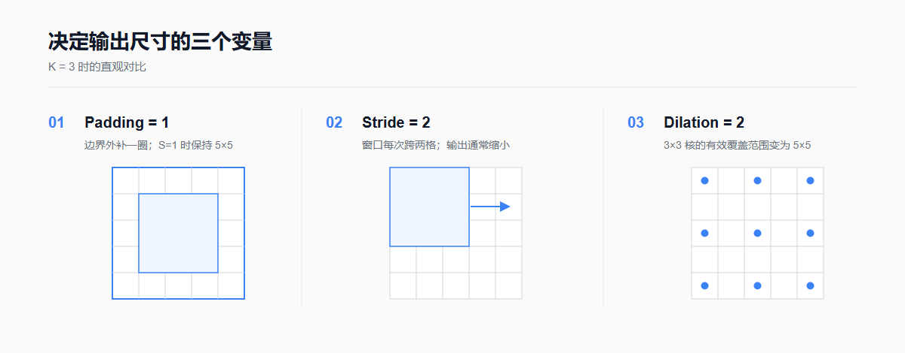
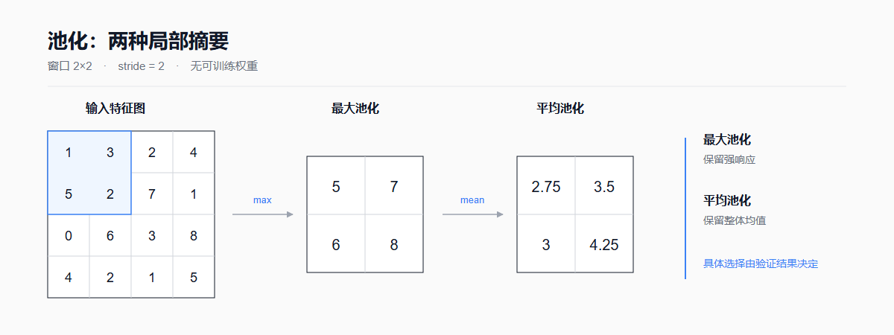

# 一文真正读懂卷积神经网络（CNN）：从卷积公式到 PyTorch 实践

CNN（Convolutional Neural Network，卷积神经网络）是一类擅长处理网格状数据的深度学习模型。我们最熟悉的网格状数据就是图像，所以 CNN 常常用于图像分类、检测和分割。除此之外，它也可以处理语音时频图、时间序列和三维体数据。

如果只把 CNN 记成“卷积层 + 池化层 + 全连接层”，我们也许能照着代码搭出模型，却不一定真正理解它为什么有效。因此，这篇文章会从图像在计算机中的表示方式讲起，再一步步介绍卷积、池化、归一化、感受野和训练过程。文章最后还准备了一个可以直接运行的 CIFAR-10 分类示例，方便我们把前面的概念落到代码上。



*图 1：典型 CNN 数据流。空间分辨率通常逐层减小，通道数通常逐层增加，但这不是必须遵守的定律。*

## 一. CNN 解决了全连接网络的什么问题？

在介绍 CNN 之前，我们先看看普通全连接网络面对图像时会遇到什么问题。一张 RGB 图像可以表示为 $C\times H\times W$ 的张量。如果图像大小为 $224\times224$，那么仅输入就包含 $3\times224\times224=150{,}528$ 个数。假设再把它们直接连接到 1,000 个神经元，大约需要 1.5 亿个权重。这不仅计算代价很高，还会把原本相邻的像素当成彼此无关的数字，忽略图像本身的空间结构。

CNN 主要通过下面三个特点来解决这个问题：

1. **局部连接**：每个输出只关注输入中的一小块区域。这很符合图像的特点，因为相邻像素之间通常比距离很远的像素联系更紧密。
2. **参数共享**：同一个卷积核会在图像的不同位置重复使用。也就是说，如果它学会了检测某种边缘，就不需要在每个位置从头学一遍。
3. **分层表示**：浅层通常先学习边缘、颜色和纹理，更深的网络层再把这些局部模式组合起来，逐渐形成物体部件甚至更完整的语义特征。

参数共享还带来一个重要性质：当输入图像平移时，卷积得到的特征图也会跟着平移，这种性质叫作**平移等变性**。不过，“等变”并不等于“不变”：它不能保证图像无论怎样平移，分类结果都完全一样。下采样、边界处理、数据增强和最后的特征聚合方式，都会影响模型对平移的适应能力。

## 二. 输入不是“图片”，而是张量

在我们眼中，输入是一张张图片；但在神经网络眼中，它们其实是由数字组成的多维数组，也就是张量。深度学习框架常用下面两种方式排列图像数据：

- NCHW：$(N,C,H,W)$，PyTorch 默认使用；
- NHWC：$(N,H,W,C)$，部分框架和硬件更偏好。

其中，$N$ 表示一次送入模型的图像数量，$C$ 表示通道数，$H$ 和 $W$ 分别表示高度和宽度。例如，一批有 64 张 CIFAR-10 彩色图像，每张图像包含 3 个颜色通道，尺寸为 $32\times32$，那么它在 PyTorch 中的形状就是 $(64,3,32,32)$。

常见预处理包括：

$$
x'=\frac{x/255-\mu}{\sigma}
$$

这里的 $\mu$ 和 $\sigma$ 分别是均值和标准差，应当在训练集上按通道统计。验证集和测试集要使用同样的变换。在训练阶段，我们还常会通过随机裁剪、翻转和颜色扰动来增加数据的多样性；而在验证和测试时，则不应再使用会随机改变样本语义的增强。

## 三. 卷积层：局部加权求和

### 3.1 从一次卷积计算说起

卷积操作的基本想法并不复杂：用一个较小的卷积核在输入上滑动，每到一个位置，就将对应元素相乘后求和。对于单通道输入，当卷积核大小为 $K_h\times K_w$、步幅为 $S_h,S_w$、膨胀率为 $D_h,D_w$ 时，输出位置 $(i,j)$ 的计算可以写成：

$$
Y_{i,j}=b+\sum_{u=0}^{K_h-1}\sum_{v=0}^{K_w-1}
W_{u,v}\,X_{iS_h+uD_h-P_h,\;jS_w+vD_w-P_w}.
$$

如果计算位置超出了输入边界，就按照填充规则处理。这里还有一个容易混淆的细节：严格意义上的数学卷积会先翻转卷积核，而 PyTorch 等深度学习框架通常直接计算互相关（cross-correlation）。不过，由于卷积核的参数是从数据中学出来的，翻不翻转并不影响模型的表达能力，所以大家仍然习惯把这一运算叫作“卷积”。



*图 2：一个 3×3 核在 5×5 输入上滑动。图中只展开了一个输出位置的计算。*

### 3.2 多输入通道与多输出通道

真实的彩色图像通常包含多个通道。因此，卷积核不仅要在高和宽的方向上滑动，还要同时覆盖全部输入通道。先不考虑分组卷积，第 $o$ 个输出通道可以写成：

$$
Y_{n,o,i,j}=b_o+
\sum_{c=0}^{C_{in}-1}\sum_{u=0}^{K_h-1}\sum_{v=0}^{K_w-1}
W_{o,c,u,v}\,X_{n,c,iS_h+uD_h-P_h,jS_w+vD_w-P_w}.
$$

简单来说，一个普通卷积核会跨过所有输入通道，最后生成一张特征图。如果设置 $C_{out}$ 组卷积核，就会得到 $C_{out}$ 张特征图。此时权重张量的形状为：

$$
(C_{out},\ C_{in}/G,\ K_h,\ K_w),
$$

其中 $G$ 就是 `groups`。普通卷积中 $G=1$；当 $G=C_{in}$ 时，就进入了深度卷积（depthwise convolution）的核心情形。

### 3.3 输出尺寸

卷积计算完成后，特征图究竟会变成多大？要回答这个问题，我们先定义卷积核的有效尺寸：

$$
K_{eff}=D(K-1)+1.
$$

则高度方向输出尺寸为：

$$
H_{out}=\left\lfloor
\frac{H_{in}+2P_h-D_h(K_h-1)-1}{S_h}+1
\right\rfloor,
$$

宽度同理：

$$
W_{out}=\left\lfloor
\frac{W_{in}+2P_w-D_w(K_w-1)-1}{S_w}+1
\right\rfloor.
$$

例如，当 $H_{in}=32,K=3,S=1,P=1,D=1$ 时，可以算得 $H_{out}=32$，也就是说卷积前后的高度没有变化。这就是我们常说的 same-size 卷积。需要注意的是，不同框架对字符串 `padding="same"` 与步幅组合的支持可能不同，实际使用时应以具体的 API 文档为准。



*图 3：填充、步幅和膨胀率分别影响边界、采样间隔与有效感受范围。*

### 3.4 参数量与计算量

分组卷积的可训练参数量为：

$$
\#\mathrm{params}=C_{out}\left(\frac{C_{in}}{G}K_hK_w+\mathbf{1}_{bias}\right).
$$

以 `Conv2d(3, 32, 3, padding=1)` 为例，若包含偏置：

$$
32\times(3\times3\times3+1)=896.
$$

从公式中可以看出，卷积层的参数量与输入图像的高和宽无关。不过，图像越大，卷积核需要滑动的位置越多，乘加运算量仍然会增长。粗略的乘加次数为：

$$
\mathrm{MACs}=H_{out}W_{out}C_{out}\frac{C_{in}}{G}K_hK_w.
$$

还要留意，不同工具的统计方式并不完全一致。有的工具把一次乘法和一次加法合计为 1 MAC，有的则计为 2 FLOPs。所以在比较模型时，最好一并说明统计口径。

## 四. 激活函数：让网络学会更复杂的特征

如果层与层之间只有线性变换，那么无论堆叠多少层，整个网络最后仍然只相当于一次线性变换，无法表示复杂的特征。激活函数的作用，就是为网络引入非线性。ReLU 是 CNN 中最经典的激活函数：

$$
\operatorname{ReLU}(x)=\max(0,x),\qquad
\operatorname{ReLU}'(x)=
\begin{cases}
1,&x>0\\
0,&x<0
\end{cases}
$$

ReLU 的计算很简单，并且在正半轴能保持稳定的梯度。它也有缺点：有些神经元可能长期落在负半轴，输出和梯度一直为 0，从而停止更新，这就是所谓的“死亡 ReLU”。一种常见的替代方案是 Leaky ReLU：

$$
\operatorname{LeakyReLU}(x)=\max(\alpha x,x),\quad \alpha>0.
$$

GELU、SiLU 等更平滑的激活函数，在现代网络中也很常见。没有哪一种激活函数能在所有任务上都表现最好，实际使用时仍然需要通过验证集进行选择。

## 五. 归一化：让中间特征更稳定

随着网络不断加深，中间特征的数值范围可能发生较大变化，这会给训练带来困难。二维批归一化（Batch Normalization，BN）会针对每个通道，利用一个 mini-batch 中 $N,H,W$ 这些位置上的数值统计均值和方差：

$$
\hat{x}=\frac{x-\mu_B}{\sqrt{\sigma_B^2+\epsilon}},\qquad
y=\gamma\hat{x}+\beta.
$$

$\gamma$ 和 $\beta$ 是可以通过训练学习的参数。BN 在训练时使用当前批次的统计量，同时更新移动统计量；在推理时，通常使用训练阶段积累下来的统计量。正因如此，训练前需要调用 `model.train()`，验证或推理前则要调用 `model.eval()`。

当批量很小时，BN 计算出的统计量可能不够稳定，这时可以考虑 GroupNorm 或 LayerNorm。常见的卷积块顺序是 `Conv → BN → ReLU`。如果 BN 紧跟在卷积层后，并且开启了仿射参数，那么卷积层的偏置通常可以关闭，因为 BN 中已经有可学习的平移量 $\beta$。

## 六. 池化与下采样

对窗口 $\Omega_{i,j}$，最大池化和平均池化分别为：

$$
y_{i,j}^{max}=\max_{(u,v)\in\Omega_{i,j}}x_{u,v},
\qquad
y_{i,j}^{avg}=\frac{1}{|\Omega_{i,j}|}\sum_{(u,v)\in\Omega_{i,j}}x_{u,v}.
$$



*图 4：2×2、步幅为 2 的最大池化与平均池化。*

池化层本身没有需要学习的权重。它的主要作用是降低特征图的空间分辨率，从而减少计算，同时扩大后续单元的有效感受野。最大池化倾向于保留局部区域中的强响应，平均池化则保留局部平均信息。

池化可以带来一定的局部平移鲁棒性，但不能简单地说“池化一定能防止过拟合”。模型是否过拟合，还会受到模型容量、数据量、数据增强、正则化方法和训练过程等多种因素的影响。

在现代 CNN 中，人们也常用带步幅的卷积来完成可学习的下采样。到了分类网络的末端，则经常使用全局平均池化：

$$
z_c=\frac{1}{HW}\sum_{i=1}^{H}\sum_{j=1}^{W}x_{c,i,j},
$$

它会把每个通道压缩成一个数。这样既能避免使用庞大的全连接层，也让模型可以接收一定范围内、尺寸不完全相同的输入。

## 七. 感受野：深层为什么能看到更大范围？

感受野，指的是某个特征位置在理论上会受到输入图像中哪些像素的影响。我们可以把它理解为该位置在原图上“能看到的范围”。设第 $l$ 层之前的感受野为 $r_{l-1}$，相邻特征点在原输入上的间隔为 $j_{l-1}$，则：

$$
j_l=j_{l-1}S_l,
$$

$$
r_l=r_{l-1}+(K_l-1)D_lj_{l-1},
$$

初始时 $r_0=j_0=1$。两个步幅为 1 的 3×3 卷积叠加后，可以得到 5×5 的理论感受野；叠加三个时，则可以得到 7×7 的理论感受野。按单通道简化计算，三个 3×3 卷积只需要 $3\times9=27$ 个空间核权重，少于单个 7×7 卷积核的 49 个权重，而且中间还多了两次非线性变换。

不过，理论感受野并不等于有效感受野。在真实网络中，感受野内部不同位置对输出的影响通常并不均匀。

## 八. 分类头、Softmax 与交叉熵

经过前面的卷积主干和全局平均池化后，模型已经把一张图像压缩成了一组特征。接下来，线性层会生成 $C$ 个 logits：

$$
\mathbf{z}=W\mathbf{h}+\mathbf{b}.
$$

logits 可以理解为模型对各个类别给出的原始分数。Softmax 会再把这些分数转换为概率：

$$
p_c=\frac{e^{z_c}}{\sum_{k=1}^{C}e^{z_k}}.
$$

单个样本、真实类别为 $y$ 时，交叉熵为：

$$
\mathcal{L}=-\log p_y
=-z_y+\log\sum_{k=1}^{C}e^{z_k}.
$$

实际编程时，我们应当使用数值更稳定的组合实现。PyTorch 的 `nn.CrossEntropyLoss` 接收的是**未归一化的 logits**，它在内部已经完成了等价于 `log_softmax + NLLLoss` 的计算。因此，训练代码中不要在输入交叉熵损失前手动调用 `softmax`。

## 九. CNN 是怎样学会卷积核的？

前面介绍的卷积核并不是由人手工指定的，而是模型在训练过程中逐渐学会的。训练的目标，是让模型在训练集上的平均损失尽可能小。我们还可以在目标中加入权重衰减等正则项：

$$
\min_{\theta}\ \frac{1}{N}\sum_{i=1}^{N}\mathcal{L}
\bigl(f_{\theta}(x_i),y_i\bigr)+\lambda R(\theta).
$$

一次 mini-batch 的训练大致包含下面几个步骤：

1. 进行前向传播，得到 logits 和损失；
2. 进行反向传播，利用链式法则计算 $\nabla_{\theta}\mathcal{L}$；
3. 由优化器更新参数，例如最基本的 SGD：

$$
\theta_{t+1}=\theta_t-\eta\nabla_{\theta}\mathcal{L}_t;
$$

4. 在独立的验证集上观察模型的泛化能力，并据此调整超参数。测试集只留到最后做一次正式评估。

Dropout、权重衰减、数据增强、早停和增加数据量，都可以帮助缓解过拟合，但具体怎样选择，仍然要看验证集上的表现。只看到训练损失下降，并不能说明模型没有过拟合。我们必须把训练集和验证集的指标放在一起观察。

## 十. 一个尺寸可以逐层核对的小型 CNN

理解了前面的概念后，我们再来看一个具体的网络。下面这个小型 CNN 适用于 32×32 的 RGB 图像，每一层的输出尺寸都可以直接核对：

| 阶段 | 操作 | 输出形状（省略批维） |
|---|---|---:|
| 输入 | — | $3\times32\times32$ |
| Block 1 | 3×3 Conv, BN, ReLU | $32\times32\times32$ |
| Block 2 | 3×3 Conv, stride 2, BN, ReLU | $64\times16\times16$ |
| Block 3 | 3×3 Conv, stride 2, BN, ReLU | $128\times8\times8$ |
| 聚合 | Global Average Pooling | $128\times1\times1$ |
| 分类 | Flatten, Linear | $10$ logits |

核心模型代码如下：

```python
import torch
from torch import nn


class SmallCNN(nn.Module):
    def __init__(self, num_classes: int = 10):
        super().__init__()
        self.features = nn.Sequential(
            nn.Conv2d(3, 32, 3, padding=1, bias=False),
            nn.BatchNorm2d(32),
            nn.ReLU(inplace=True),

            nn.Conv2d(32, 64, 3, stride=2, padding=1, bias=False),
            nn.BatchNorm2d(64),
            nn.ReLU(inplace=True),

            nn.Conv2d(64, 128, 3, stride=2, padding=1, bias=False),
            nn.BatchNorm2d(128),
            nn.ReLU(inplace=True),
        )
        self.pool = nn.AdaptiveAvgPool2d(1)
        self.classifier = nn.Linear(128, num_classes)

    def forward(self, x: torch.Tensor) -> torch.Tensor:
        x = self.features(x)
        x = self.pool(x)
        x = torch.flatten(x, 1)
        return self.classifier(x)  # logits，不要在这里 softmax


model = SmallCNN()
dummy = torch.randn(8, 3, 32, 32)
assert model(dummy).shape == (8, 10)
```

完整且可运行的 CIFAR-10 训练与评估脚本，可以在同目录的 [`cnn_cifar10.py`](cnn_cifar10.py) 中找到。脚本中包含了训练和测试数据变换、训练循环、评估函数、随机种子和最佳权重保存。这里不预先承诺某一个准确率，因为实际结果会受随机性、PyTorch 版本、硬件、训练轮数和超参数等多种因素影响。

## 十一. 从经典 CNN 到现代架构

- **LeNet-5（1998）**：把局部感受野、共享权重和下采样用于手写字符识别，是 CNN 发展史上的标志性系统之一。将 CNN 简单归为某一个人的“单独发明”并不严谨；相关思想由多项早期工作逐步形成，LeCun、Bottou、Bengio 与 Haffner 的论文系统展示了其在文档识别中的效果。
- **AlexNet（2012）**：在大规模 ImageNet 任务中结合深层 CNN、GPU 训练、ReLU、数据增强与 Dropout，显著推动了深度学习在视觉领域的普及。
- **VGG（2014）**：展示了重复堆叠小型 3×3 卷积的简洁设计。
- **ResNet（2015/2016）**：通过快捷连接学习残差映射：

$$
\mathbf{y}=\mathcal{F}(\mathbf{x},W)+\mathbf{x},
$$

这种结构缓解了深层普通网络中的优化退化问题。这里所说的“退化”，是指更深的普通网络反而出现更高的训练误差，它和过拟合并不是一回事。

此后，深度可分离卷积、空洞卷积、注意力机制以及 ConvNeXt 等设计也相继出现。如今，视觉 Transformer 已经成为一条重要的技术路线，但 CNN 凭借局部性、计算效率和成熟的工具链，仍然广泛用于分类、检测、分割、姿态估计、医学影像和端侧部署等任务。

## 十二. 常见误区与排错清单

### 误区 1：卷积核都是 Sobel、锐化或高斯核

Sobel、锐化和高斯核这些手工滤波器，很适合帮助我们理解局部滤波。但是，CNN 中的卷积核通常从随机初始化出发，再通过反向传播从数据中学习。第一层有时会学出类似边缘或颜色检测器的模式，而更深层的特征就很难再用某个传统滤镜单独解释了。

### 误区 2：特征图数量由输入通道数决定

输出通道数不是由输入通道数自动决定的，而是由卷积层中的卷积核组数决定，对应参数就是 `out_channels`。每个普通卷积核都会跨越所有输入通道。

### 误区 3：网络越深一定越好

增加深度可以提高模型的表达能力，但也会增加优化难度、计算量、内存开销和过拟合风险。残差连接能让深层网络更容易优化，却不能保证只要继续增加层数，验证集上的性能就一定会提升。

### 误区 4：测试准确率越高，模型就一定可用

准确率很重要，但它不是唯一标准。我们还需要检查数据泄漏、类别不平衡、分布偏移、校准、鲁棒性、推理延迟和错误代价。对于不均衡数据，只报告总体准确率往往还不够，最好补充每类召回率、宏平均 F1、混淆矩阵或其他适合当前任务的指标。

### 训练排错清单

- 输入形状是否为模型期望的 NCHW，像素归一化是否与预训练权重匹配？
- `CrossEntropyLoss` 前是否误加了 `softmax`？类别标签是否为 `[0,C)` 的整数？
- 每个 epoch 是否正确切换 `model.train()` 与 `model.eval()`？
- 验证时是否使用 `torch.inference_mode()`，并关闭随机数据增强？
- 是否同时记录训练损失、训练指标和验证指标，而不是仅观察一条曲线？
- 是否先让模型在极小数据集上过拟合，以验证数据、损失和梯度链路确实可工作？
- 保存的是验证指标最优权重，还是未经选择的最后一个 epoch？

## 十三. 小结

回过头来看，CNN 的核心并不是使用某种固定滤镜，而是让共享的小型卷积核从数据中学习，先在局部区域提取模式，再通过非线性、下采样和多层组合，逐渐得到分层特征。如果理解了下面四点，就基本抓住了 CNN 的主干：

1. 卷积层通常执行互相关；权重由数据学习；
2. 输出尺寸由输入、填充、步幅、核大小和膨胀率共同决定；
3. 参数共享显著减少参数，并带来平移等变性；
4. 模型的最终性能来自完整的训练系统，不只取决于网络层数。数据划分、数据增强、损失函数、优化、正则化和评估方法同样重要。

## 参考资料

1. [参考文章：一文读懂卷积神经网络（CNN）](https://zhuanlan.zhihu.com/p/561991816)，知乎专栏。
2. Yann LeCun, Léon Bottou, Yoshua Bengio, Patrick Haffner, [Gradient-Based Learning Applied to Document Recognition](https://bottou.org/papers/lecun-98h), *Proceedings of the IEEE*, 1998.
3. Alex Krizhevsky, Ilya Sutskever, Geoffrey E. Hinton, [ImageNet Classification with Deep Convolutional Neural Networks](https://papers.nips.cc/paper_files/paper/2012/hash/c399862d3b9d6b76c8436e924a68c45b-Abstract.html), NeurIPS 2012.
4. Kaiming He, Xiangyu Zhang, Shaoqing Ren, Jian Sun, [Deep Residual Learning for Image Recognition](https://openaccess.thecvf.com/content_cvpr_2016/html/He_Deep_Residual_Learning_CVPR_2016_paper.html), CVPR 2016.
5. [PyTorch `Conv2d` 官方文档](https://docs.pytorch.org/docs/stable/generated/torch.nn.Conv2d.html)：运算定义、参数、分组与输出尺寸。
6. [PyTorch `BatchNorm2d` 官方文档](https://docs.pytorch.org/docs/stable/generated/torch.nn.BatchNorm2d.html)：训练/推理统计量与计算公式。
7. [PyTorch `CrossEntropyLoss` 官方文档](https://docs.pytorch.org/docs/stable/generated/torch.nn.CrossEntropyLoss.html)：logits、类别索引与交叉熵定义。
