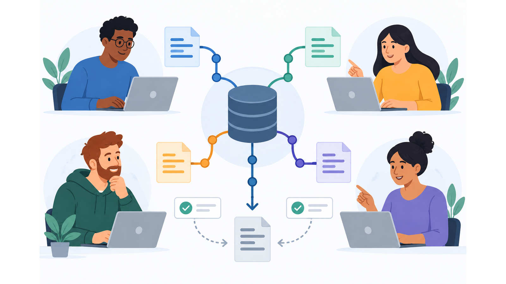
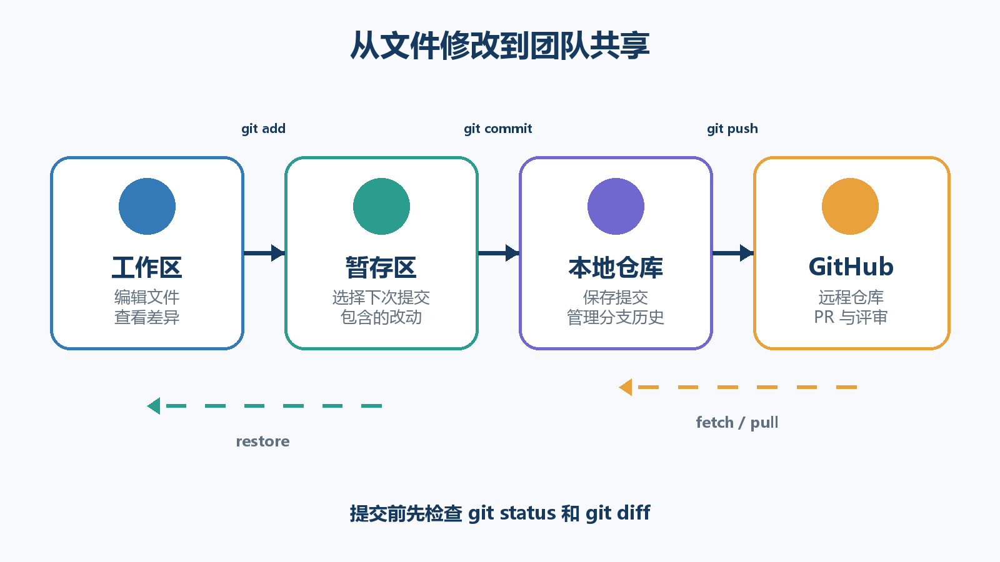
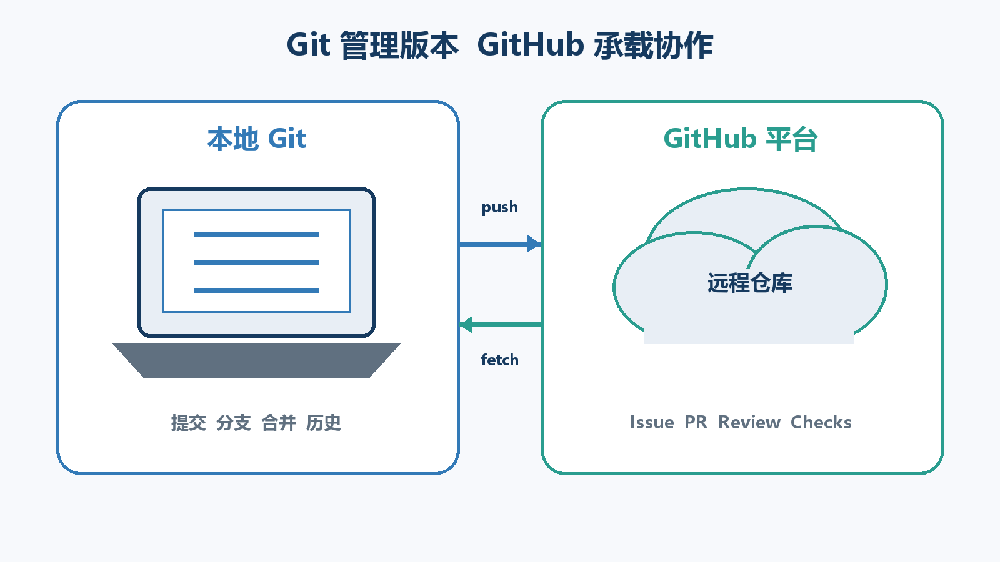
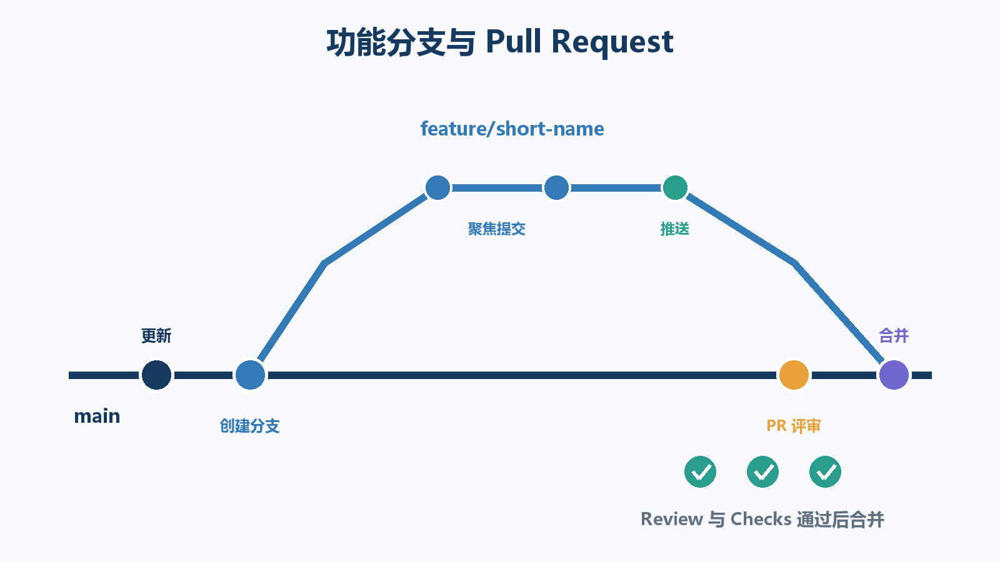
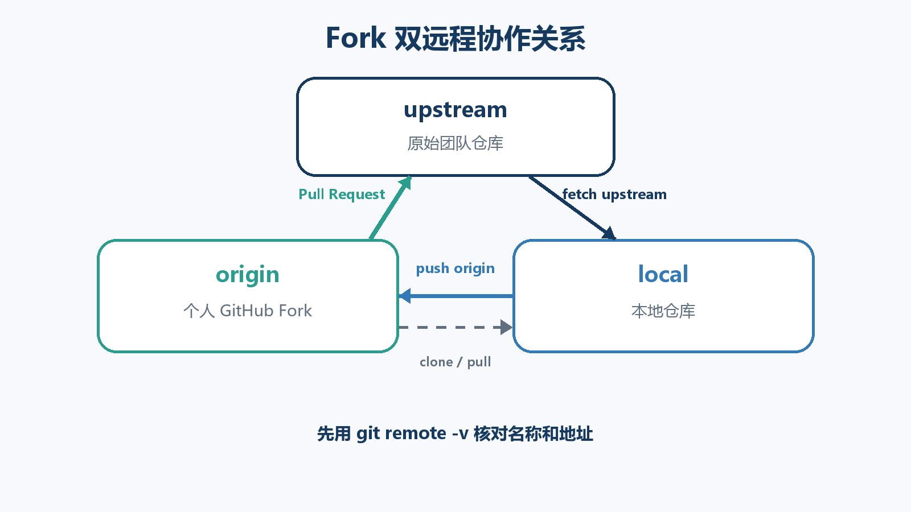

# 团队开发与 Git GitHub 操作指南

版本：v1.0.0
状态：生效
适用对象：首次参与团队开发、尚未系统使用 Git 与 GitHub 的成员
主要环境：Windows 11、PowerShell、Git、GitHub、Visual Studio Code
最后更新：2026-09-14

## 前言

团队开发的核心不是让多人同时修改文件，而是让每一项改动都有明确来源、可被检查、可以撤销，并在进入稳定分支前得到验证。本指南从版本控制的基本概念开始，逐步讲解 Git 命令、GitHub 协作、功能分支、Fork、Pull Request、代码评审以及本项目采用的 main-only 流程。

阅读本指南时，请先理解命令会改变什么状态，再复制命令。每次执行会修改分支、提交或远程仓库的操作前，至少运行一次 `git status`，并确认当前仓库、当前分支和待提交文件都符合预期。

本指南使用虚构仓库 `team-demo`、虚构组织 `example-org` 和占位账号 `your-name`。请将示例中的占位内容替换为实际值，不要直接照搬仓库地址或身份信息。



*图 1 团队成员围绕共享版本库完成开发与评审*

## 目录

- [第一章 团队开发与版本控制](#第一章-团队开发与版本控制)
- [第二章 Git 与 GitHub](#第二章-git-与-github)
- [第三章 Windows 环境准备](#第三章-windows-环境准备)
- [第四章 Git 基础操作](#第四章-git-基础操作)
- [第五章 功能分支与 Pull Request](#第五章-功能分支与-pull-request)
- [第六章 Fork 协作](#第六章-fork-协作)
- [第七章 main-only 分支与交付](#第七章-main-only-分支与交付)
- [第八章 Pull Request 与代码评审](#第八章-pull-request-与代码评审)
- [第九章 冲突处理与安全撤销](#第九章-冲突处理与安全撤销)
- [第十章 故障排查](#第十章-故障排查)
- [附录 A 高频命令速查](#附录-a-高频命令速查)
- [附录 B 操作检查清单](#附录-b-操作检查清单)
- [附录 C 术语表](#附录-c-术语表)
- [附录 D 参考资料](#附录-d-参考资料)

## 第一章 团队开发与版本控制

### 1.1 团队开发解决什么问题

个人开发时，一个人通常同时决定修改内容、验证方式和发布时间。团队开发则需要多人在同一套代码和文档上工作。如果缺少约定，常见后果包括互相覆盖文件、无法判断某项修改由谁引入、错误进入稳定版本，以及出现问题后无法快速恢复。

团队协作需要回答五个问题：谁负责这项任务，修改发生在哪个分支，为什么要修改，谁验证过修改，以及出现问题时如何撤销。Git 保存文件版本和历史，GitHub 保存远程仓库并承载任务、评审与权限控制。二者共同提供技术基础，但团队仍需建立明确的工作流程。

### 1.2 团队成员的基本职责

| 角色 | 主要职责 | 不应省略的动作 |
| --- | --- | --- |
| 任务负责人 | 明确目标、范围和验收条件 | 在开发前说明什么算完成 |
| 开发者 | 在独立分支完成修改并自检 | 检查差异、提交范围和验证结果 |
| 评审者 | 检查正确性、风险和可维护性 | 阅读实际 diff，不只看 PR 描述 |
| 测试或验收人员 | 按约定场景验证结果 | 记录通过项、失败项和证据 |
| 合并或发布负责人 | 确认门禁并执行合并或发布 | 检查审批、自动检查和回退条件 |

一个人可以同时承担多个角色，但在关键改动中，作者不应成为唯一评审者。评审的价值在于引入第二视角，而不是完成形式上的点击。

### 1.3 版本控制的基本对象

- **仓库 Repository**：保存文件、提交历史、分支和标签的集合。
- **工作区 Working tree**：当前磁盘上可以直接编辑的文件。
- **暂存区 Staging area**：下一次提交准备包含的改动集合。
- **提交 Commit**：某一时刻的受控快照，包含作者、时间、说明和父提交关系。
- **分支 Branch**：指向一条提交历史的可移动引用。
- **合并 Merge**：把一条分支的改动整合到另一条分支。
- **远程仓库 Remote**：通过网络访问的仓库副本，通常托管在 GitHub。



*图 2 Git 本地状态与远程仓库之间的数据流*

### 1.4 安全操作顺序

执行 Git 操作前，按以下顺序检查：

1. 使用 `Get-Location` 确认 PowerShell 当前目录。
2. 使用 `git status` 确认这是 Git 仓库并查看当前分支。
3. 使用 `git diff` 和 `git diff --staged` 查看未暂存与已暂存差异。
4. 使用 `git branch --show-current` 再次确认目标分支。
5. 只在状态符合预期时执行提交、合并、推送或撤销操作。

> 安全提示：命令执行成功不代表操作对象正确。进入了错误目录或停留在错误分支时，正确命令仍会产生错误结果。

## 第二章 Git 与 GitHub

### 2.1 什么是 Git

Git 是分布式版本控制系统。每次正常克隆都会得到仓库历史的本地副本，因此开发者可以在本地查看历史、创建分支和提交改动。Git 负责跟踪文件内容和提交关系，不要求必须使用 GitHub。

Git 的主要用途是：记录版本、比较差异、并行开发、合并成果和恢复已知状态。`git status`、`git add`、`git commit`、`git branch` 和 `git merge` 等命令均由 Git 提供。

### 2.2 什么是 GitHub

GitHub 是托管 Git 仓库并提供协作功能的网络平台。除保存远程仓库外，它还提供账号和组织管理、Issue、Pull Request、代码评审、分支保护、自动检查、发布记录等功能。

简单地说，Git 管理版本历史，GitHub 让团队围绕这份历史协作。没有 GitHub 也可以使用 Git；没有安装 Git，也可以在 GitHub 网页上执行少量编辑，但无法完整使用本地开发和验证流程。



*图 3 Git 与 GitHub 的职责关系*

### 2.3 GitHub 的核心对象

| 对象 | 作用 | 初学者需要记住的内容 |
| --- | --- | --- |
| Account | 个人身份 | 提交邮箱和 GitHub 账号应正确关联 |
| Organization | 团队或组织空间 | 仓库权限通常由组织统一管理 |
| Repository | 远程仓库 | 包含代码、历史、Issue、PR 和设置 |
| Issue | 任务或问题记录 | 应写清背景、目标、验收和负责人 |
| Pull Request | 合并请求 | 用于提议、讨论、检查和合并改动 |
| Review | 代码评审 | 可评论、批准或要求修改 |
| Checks | 自动检查结果 | 构建、测试或规则通过后才可合并 |
| Actions | 自动化工作流 | 常用于检查、构建、部署和定时任务 |
| Release | 面向使用者的版本记录 | 通常关联标签、说明和构建产物 |

### 2.4 仓库可见性和权限

公开仓库允许任何人查看，私有仓库只对获授权的账号开放。可见性不等于修改权限。一个人能够查看仓库，并不表示他可以推送分支或合并 PR。

常见权限从低到高包括只读、问题管理、写入、维护和管理。团队应遵循最小权限原则：只授予成员完成职责所需的权限。主分支和阶段分支应使用分支保护规则，要求通过 PR、状态检查和必要审批后才能合并。

### 2.5 Clone Fork 和下载 ZIP 的区别

| 操作 | 得到什么 | 是否保留 Git 历史 | 典型用途 |
| --- | --- | --- | --- |
| Clone | 远程仓库的本地 Git 副本 | 是 | 日常开发和提交 |
| Fork | 自己账号下的远程仓库副本 | 是 | 无上游写权限或隔离协作 |
| Download ZIP | 当前文件的压缩包 | 否 | 只查看或临时使用文件 |

下载 ZIP 后得到的目录通常没有 `.git`，无法直接执行正常的 pull、commit 和 push 流程。需要参与协作时，应使用 clone；没有原仓库写权限时，通常先 fork，再 clone 自己的 Fork。

## 第三章 Windows 环境准备

### 3.1 安装 Git

从 [Git 官方下载页](https://git-scm.com/download/win) 获取 Windows 安装程序。安装过程中，如果团队没有特殊要求，可保留默认选项。安装完成后重新打开 PowerShell，运行：

```powershell
git --version
```

预期输出包含版本号，例如 `git version 2.x.x.windows.x`。如果提示找不到 `git`，先关闭并重新打开终端；仍无效时检查 Git 是否安装成功以及 PATH 配置。

### 3.2 安装 VS Code

从 [Visual Studio Code 官方网站](https://code.visualstudio.com/) 下载安装。VS Code 内置 Git 图形界面，但仍使用计算机上安装的 Git。仅安装 VS Code 不能替代 Git。

在 VS Code 中按 `Ctrl+Shift+G` 可以打开“源代码管理”视图。按 `Ctrl+Shift+P` 打开命令面板，可搜索 `Git: Clone`、`Git: Create Branch` 等操作。

### 3.3 配置身份

首次提交前配置用户名和邮箱：

```powershell
git config --global user.name "Your Name"
git config --global user.email "you@example.com"
git config --global init.defaultBranch main
```

检查配置：

```powershell
git config --global --list
git config --show-origin --get user.name
git config --show-origin --get user.email
```

`user.name` 和 `user.email` 会写入新提交。它们不是 GitHub 登录凭据。邮箱应使用团队认可的地址，或使用 GitHub 提供的隐私邮箱。

### 3.4 配置认证

使用 HTTPS 克隆时，GitHub 不接受把账号密码直接当作 Git 操作密码。Windows 上通常由 Git Credential Manager 打开浏览器完成授权并安全保存凭据。个人访问令牌只应授予必要范围，不能写入仓库、截图、聊天记录或脚本。

SSH 方式使用公钥和私钥。公钥可添加到 GitHub，私钥只能保存在本人可信设备中。初学者如果没有团队统一 SSH 配置，可先使用 HTTPS。

建议为 GitHub 账号启用双重认证，并妥善保存恢复方式。收到异常登录或授权提示时，应先确认域名和操作来源。

### 3.5 第一次克隆

命令行方式：

```powershell
Set-Location D:\Work
git clone https://github.com/example-org/team-demo.git
Set-Location .\team-demo
git status
git remote -v
```

VS Code 方式：

1. 按 `Ctrl+Shift+P`。
2. 选择 `Git: Clone`。
3. 粘贴仓库 HTTPS 地址。
4. 选择用于保存仓库的父目录。
5. 克隆完成后选择“打开”。
6. 只在确认仓库来源可信后接受 Workspace Trust。

预期结果是 `git status` 显示当前分支和干净工作区，`git remote -v` 显示名为 `origin` 的远程地址。

## 第四章 Git 基础操作

### 4.1 初始化仓库

只有在创建全新仓库时才使用 `git init`：

```powershell
New-Item -ItemType Directory team-demo
Set-Location .\team-demo
git init
git status
```

已有远程仓库时应使用 `git clone`，不要先 `git init` 再手工复制文件，否则容易产生两套无关历史。

VS Code 中可打开空目录，进入“源代码管理”，选择“初始化仓库”。初始化只创建本地仓库，不会自动在 GitHub 上创建远程仓库。

### 4.2 查看状态和差异

```powershell
git status
git status --short
git diff
git diff --staged
git log --oneline --graph --decorate -10
```

- `git status` 展示当前分支、未跟踪文件、已修改文件和暂存状态。
- `git diff` 展示尚未暂存的改动。
- `git diff --staged` 展示下一次提交将包含的改动。
- `git log` 展示已经提交的历史。

VS Code 的“源代码管理”视图会列出 Changes 和 Staged Changes。单击文件可打开差异编辑器。提交前应逐个查看文件，而不是只看文件数量。

### 4.3 暂存和提交

```powershell
git add README.md
git diff --staged
git commit -m "docs: clarify setup steps"
```

`git add` 不是把文件上传到 GitHub，而是把当前版本放入暂存区。只有暂存区中的内容会进入下一次提交。

需要暂存多个明确文件时，可逐个列出：

```powershell
git add README.md docs\guide.md
```

对初学者，不建议不检查就使用 `git add .`。它可能把临时文件、调试输出或敏感配置一起加入暂存区。

在 VS Code 中，单击文件右侧的 `+` 将其暂存；输入提交信息后选择“提交”。提交后仍需 push，远程仓库才会收到本地提交。

### 4.4 编写提交信息

推荐格式：

```text
type(scope): summary
```

常用类型：

| 类型 | 用途 | 示例 |
| --- | --- | --- |
| `feat` | 新增功能 | `feat(search): add keyword filter` |
| `fix` | 修复问题 | `fix(login): handle expired session` |
| `docs` | 修改文档 | `docs(git): add fork workflow` |
| `test` | 新增或调整测试 | `test(api): cover invalid token` |
| `refactor` | 不改变外部行为的重构 | `refactor(cache): isolate key builder` |
| `build` | 构建与依赖 | `build: pin tool version` |
| `ci` | 自动化流水线 | `ci: run checks on pull requests` |
| `chore` | 其他维护 | `chore: remove obsolete sample` |

提交信息应说明这次提交完成了什么，不要使用 `update`、`change`、`fix stuff` 等无法追踪意图的词。一个提交只表达一个可解释、可验证、可回滚的意图。

### 4.5 分支操作

查看和创建分支：

```powershell
git branch
git branch --show-current
git switch -c feature/profile-page
```

切换已有分支：

```powershell
git switch main
```

删除已经合并的本地分支：

```powershell
git branch -d feature/profile-page
```

`-d` 会阻止删除尚未合并的分支。`-D` 会强制删除，初学者不应在未确认提交已保存时使用。

VS Code 可单击窗口左下角的分支名称，或在命令面板使用 `Git: Create Branch` 和 `Git: Checkout to`。

### 4.6 远程仓库操作

```powershell
git remote -v
git fetch origin
git pull --ff-only
git push
```

- `fetch` 下载远程引用，但不修改当前工作区。
- `pull` 通常等于先 fetch 再把远程变化整合到当前分支。
- `push` 把本地提交发送到远程仓库。

第一次推送新分支：

```powershell
git push -u origin feature/profile-page
```

`-u` 建立上游跟踪关系。之后在该分支通常可以直接运行 `git push` 和 `git pull`。

### 4.7 合并分支

把 `feature/profile-page` 合入当前分支前，应先切换到接收改动的分支：

```powershell
git switch main
git merge feature/profile-page
```

团队仓库通常要求通过 GitHub PR 合并，因此不应在本地直接合并后推送受保护分支。上面命令主要用于理解合并和处理个人分支。

### 4.8 使用 gitignore

`.gitignore` 告诉 Git 哪些未跟踪文件不应纳入版本控制。常见内容：

```gitignore
# 本地环境变量
.env
.env.*

# 构建和依赖目录
node_modules/
dist/

# 编辑器和系统文件
.vscode/
Thumbs.db
```

`.gitignore` 不会自动停止跟踪已经提交的文件。敏感文件一旦进入历史，应立即停止传播、撤销相关凭据，并联系仓库管理员处理历史和访问风险；仅新增 `.gitignore` 不足以消除泄露。

## 第五章 功能分支与 Pull Request

### 5.1 默认协作模型

功能分支模型适合大多数小型和中型团队。稳定分支受到保护，每项任务在独立分支完成，通过 Pull Request 接受检查后再合并。



*图 4 功能分支与 Pull Request 协作闭环*

### 5.2 开始任务

开始修改前确认任务的目标、范围、验收方式和负责人。然后更新稳定分支：

```powershell
git status
git switch main
git fetch origin
git pull --ff-only origin main
```

如果 `git status` 显示未提交修改，不要直接切换或拉取。先判断这些修改应提交、暂存到 stash，还是安全撤销。

从最新 `main` 创建工作分支：

```powershell
git switch -c feature/profile-page
git branch --show-current
```

分支名应简短、可读，并体现工作类型。避免使用 `my-branch`、`test1` 或个人姓名作为长期命名方式。

### 5.3 修改和提交

完成一个逻辑单元后检查：

```powershell
git status
git diff
git add src\profile.js tests\profile.test.js
git diff --staged
git commit -m "feat(profile): add profile summary"
```

提交前至少确认：没有无关格式化、没有调试输出、没有凭据、没有遗漏必要测试或文档。提交并不要求一次完成整个任务，可以用多个聚焦提交逐步保存工作。

### 5.4 推送并创建 PR

```powershell
git push -u origin feature/profile-page
```

在 GitHub 仓库页面选择创建 Pull Request，确认：

- base repository 是团队仓库。
- base branch 是计划合入的分支。
- compare branch 是自己的工作分支。
- Files changed 只包含本任务改动。
- PR 描述写明原因、改动、验证结果和风险。

工作尚未完成但希望提前讨论时，可创建 Draft PR。Draft 表示仍在进行中，不应请求最终合并。

### 5.5 响应评审

评审者提出修改后，在同一个工作分支继续编辑、提交和 push。GitHub 会自动更新 PR：

```powershell
git add src\profile.js
git commit -m "fix(profile): handle missing display name"
git push
```

不要为了每条意见创建新 PR。完成修改后回复评审会话，说明采用了什么处理方式；只有确认问题已处理时才将会话标记为 resolved。

### 5.6 合并和清理

当审批和自动检查通过后，由有权限的成员合并。普通功能 PR 推荐使用 Squash and merge，使一个 PR 在目标分支上形成一个清晰提交。

合并后更新本地仓库：

```powershell
git switch main
git pull --ff-only origin main
git branch -d feature/profile-page
git fetch --prune origin
```

删除分支前确认 PR 已合并且重要提交已进入目标分支。GitHub 页面可删除远程工作分支；`fetch --prune` 用于清理已经不存在的远程跟踪引用。

## 第六章 Fork 协作

### 6.1 何时使用 Fork

Fork 适用于贡献者没有原仓库写权限、跨组织协作、开源贡献或需要更强权限隔离的情况。具有团队仓库写权限的内部成员通常使用同仓库功能分支，流程更直接。

| 条件 | 同仓库功能分支 | Fork |
| --- | --- | --- |
| 对原仓库有写权限 | 推荐 | 可用但通常没有必要 |
| 对原仓库无写权限 | 不可直接推送 | 推荐 |
| 远程仓库数量 | 一个 | 原仓库和个人 Fork 两个 |
| PR 来源 | 同仓库分支 | 个人 Fork 分支 |
| 权限隔离 | 较弱 | 较强 |

### 6.2 理解 origin 和 upstream

在 Fork 流程中，建议统一使用：

```text
upstream = 原始团队仓库
origin   = 自己账号下的 Fork
local    = 本地克隆
```



*图 5 Fork 模式中的 upstream origin 和 local*

`origin` 和 `upstream` 只是远程名称，但行业惯例采用上面的含义。运行命令前应通过 `git remote -v` 核对，不要只凭名称猜测地址。

### 6.3 创建并配置 Fork

1. 打开原始 GitHub 仓库。
2. 选择页面右上角的 Fork。
3. 选择自己的账号作为 Owner，创建 Fork。
4. 克隆自己的 Fork：

```powershell
git clone https://github.com/your-name/team-demo.git
Set-Location .\team-demo
git remote -v
```

5. 添加原仓库为 `upstream`：

```powershell
git remote add upstream https://github.com/example-org/team-demo.git
git remote -v
```

预期结果：`origin` 指向 `your-name/team-demo`，`upstream` 指向 `example-org/team-demo`。

### 6.4 同步上游

更新个人 Fork 的 `main`：

```powershell
git status
git fetch upstream
git switch main
git merge --ff-only upstream/main
git push origin main
```

`fetch upstream` 只下载上游状态。`merge --ff-only` 仅在本地 `main` 没有额外分叉时快进更新；如果失败，应先调查本地 `main` 为什么含有独立提交，不要立刻改用强制推送。

### 6.5 创建跨仓库 PR

从已同步的 `main` 创建分支：

```powershell
git switch -c docs/clarify-installation
git add docs\installation.md
git commit -m "docs(setup): clarify Windows installation"
git push -u origin docs/clarify-installation
```

创建 PR 时检查四个字段：

- **base repository**：原始团队仓库 `example-org/team-demo`。
- **base branch**：上游希望接收改动的分支，例如 `main`。
- **head repository**：个人 Fork `your-name/team-demo`。
- **compare branch**：个人工作分支 `docs/clarify-installation`。

评审期间继续向 `origin` 的同一工作分支 push，PR 会自动更新。上游合并后，同步自己的 `main`，再删除个人工作分支。

### 6.6 Fork 常见错误

- `origin` 指向了原仓库：重新核对 `git remote -v`，必要时使用 `git remote set-url origin <个人Fork地址>`。
- 没有 `upstream`：使用 `git remote add upstream <原仓库地址>`。
- PR 方向相反：关闭错误 PR，重新选择正确的 base 与 compare。
- Fork 落后：先 fetch upstream 并同步目标基线，再更新功能分支。
- 无法 push：确认推送目标是有权限的个人 Fork，而不是无写权限的 upstream。

## 第七章 main-only 分支与交付

### 7.1 使用场景

本项目采用单一 `main` 长期分支。开发集成、验收和发布基线均围绕 `main` 的可审计提交完成；测试环境和发布候选使用固定提交 SHA、CI 记录和 Tag 表达，不创建额外长期环境分支。

```text
agent/* → main
```

工作分支合并后删除；`main` 负责保存唯一长期基线，发布候选和回滚点由 Tag 及测试证据记录。

### 7.2 分支职责

| 分支 | 主要职责 | 允许进入的内容 | 典型门禁 |
| --- | --- | --- | --- |
| `main` | 唯一长期集成、验收和发布基线 | 通过 PR 和 CI 检查的任务改动 | 构建、静态/类型检查、测试、发布记录 |
| `agent/*` | 单项功能、修复、重构或文档任务 | 与一个任务边界对应的可审查改动 | 本地验证、影响面检查、PR、CI |

`main` 应受保护。开发者从最新 `main` 创建 `agent/<任务说明>` 短期工作分支，通过 PR 和 CI 合入 `main`，不直接在 `main` 提交或推送。本项目不设置 Reviewer 数量作为强制合并门禁，由 Owner 完成检查和合并。

### 7.3 正向交付

普通功能从最新 `main` 创建：

```powershell
git switch main
git pull --ff-only origin main
git switch -c agent/search-filter
```

完成后通过 `agent/search-filter → main` PR 合并。PR 必须记录源分支、目标分支、纳入范围、验证结果、已知风险和回退方式。发布候选从已合入 `main` 的固定 SHA 创建 Tag，不创建长期候选分支。

### 7.4 并行开发和批次边界

多个任务可以并行使用各自的短期工作分支；每个 PR 必须明确提交范围，避免把无关改动带入 `main`。发布候选以选定的 `main` SHA、Tag、构建摘要和测试记录冻结；测试期间的新改动必须通过新的 PR 合入 `main`，不得修改既有候选证据。

### 7.5 测试缺陷

测试缺陷从最新 `main` 创建临时 `agent/*` 修复分支：

```powershell
git switch main
git pull --ff-only origin main
git switch -c agent/test-empty-result
```

修复通过 PR 合回 `main` 后，以新的提交 SHA 重新生成受影响的测试和发布候选证据。不得在已冻结的 Tag 或已发布提交上直接修复，也不需要在环境分支之间回流。

### 7.6 发布阶段缺陷和 Hotfix

正式版本的紧急问题也从 `main` 创建 `agent/*`：

```powershell
git switch main
git pull --ff-only origin main
git switch -c agent/session-expiry
```

紧急修复必须保持最小范围，验证后通过 PR 合入 `main`，再创建新的 PATCH Tag。回滚以最近一次已验证 Tag 为准，不设置额外长期回流分支。

### 7.7 Cherry pick 的边界

`git cherry-pick <commit>` 会把指定提交的改动复制到当前分支，并生成新的提交。它适合回补单一、独立的修复，不适合替代正常分支晋级。

使用前检查：

```powershell
git status
git branch --show-current
git show <commit>
git cherry-pick <commit>
```

使用后重新运行测试并在 PR 中记录原始提交。不得在长期分支之间进行无记录的 cherry-pick。

## 第八章 Pull Request 与代码评审

### 8.1 PR 描述模板

```markdown
## 背景
说明为什么需要这项修改，以及关联的 Issue。

## 改动
- 列出本 PR 实际完成的内容。
- 明确未包含的内容。

## 验证
- 命令或操作：
- 结果：

## 影响和风险
- 受影响范围：
- 已知风险：
- 回退方式：

## 作者检查
- [ ] 已查看全部 diff
- [ ] 未包含凭据或无关文件
- [ ] 已完成必要测试
- [ ] 目标分支正确
```

### 8.2 三种 Review 结果

- **Comment**：提出问题或建议，不代表批准或阻断。
- **Approve**：评审者认为改动满足合并要求。
- **Request changes**：存在必须处理的问题，处理前不应合并。

评审意见应指向具体文件和行为，说明风险或期望结果。例如，“空列表时这里会访问第一个元素，建议先处理长度为零的情况”比“这里写得不好”更容易执行。

### 8.3 作者自检

创建 PR 前确认：

- 改动与任务范围一致。
- 每个文件都经过 diff 检查。
- 提交中没有凭据、临时文件和调试输出。
- 测试和检查结果真实可复现。
- PR 目标仓库和目标分支正确。
- 描述说明了为什么修改，而不只是重复文件名。
- 回退方式与风险相匹配。

### 8.4 评审者检查

评审者至少检查：

- 需求和实际改动是否一致。
- 正常路径、异常路径和边界条件是否合理。
- 是否引入越权、敏感信息或不可信输入风险。
- 是否存在无关改动、重复实现或难以维护的结构。
- 测试能否覆盖关键行为和历史缺陷。
- 分支方向、检查结果和合并方式是否正确。

### 8.5 常见 PR 问题

- **PR 过大**：拆成可以独立评审和验证的改动，不把功能、重构、依赖升级和格式化混在一起。
- **目标分支错误**：在合并前修改 base branch，重新检查完整 diff。
- **分支落后**：先 fetch，再按团队规定合并目标分支或更新候选基线。
- **自动检查失败**：阅读失败日志并修复根因，不重复点击直到偶然通过。
- **评审会话未处理**：逐项回复修改结果或解释不采纳的理由。

## 第九章 冲突处理与安全撤销

### 9.1 为什么出现冲突

当两个分支修改同一文件的相同区域，Git 无法自动判断最终内容，就会标记冲突。冲突不是 Git 损坏，而是需要开发者理解双方意图并作出选择。

冲突文件可能包含：

```text
"<<<<<<< HEAD"
当前分支的内容
"======="
待合并分支的内容
">>>>>>> other-branch"
```

不要只删除标记后提交。应确认两侧修改的目的，决定保留一侧、组合两侧或重新编写正确结果。

### 9.2 命令行解决冲突

发生冲突后：

```powershell
git status
git diff --name-only --diff-filter=U
```

逐个编辑冲突文件，完成后：

```powershell
git add path\to\resolved-file
git status
git commit
```

如果尚未完成任何有价值的冲突解决，可以取消本次合并：

```powershell
git merge --abort
```

### 9.3 使用 VS Code Merge Editor

VS Code 会在“源代码管理”视图中列出冲突文件。打开文件后可使用 Merge Editor 查看 Current、Incoming 和 Result。选择内容后必须检查 Result，而不是仅点击 Accept Current 或 Accept Incoming。

保存解决结果，暂存文件，完成合并提交，再执行受影响的测试。界面按钮只是帮助编辑，不能替代对业务含义的判断。

### 9.4 按状态选择撤销方式

| 当前状态 | 推荐操作 | 说明 |
| --- | --- | --- |
| 未暂存修改 | `git restore <file>` | 丢弃工作区修改，执行前检查 diff |
| 已暂存但未提交 | `git restore --staged <file>` | 取消暂存，不丢弃工作区内容 |
| 本地最新提交需修改 | 新提交修正，或在未共享时谨慎 amend | 是否改写历史取决于是否已推送 |
| 已推送提交需撤销 | `git revert <commit>` | 创建反向提交，保留公共历史 |
| 合并进行中且需取消 | `git merge --abort` | 返回合并开始前状态 |

`git reset --hard` 会同时移动分支并丢弃工作区与暂存区内容。强制推送会覆盖远程历史。这两类操作不属于初学者日常流程；确需使用时，应先取得负责人确认并建立可恢复备份。

### 9.5 使用 revert

查看目标提交：

```powershell
git show <commit>
git revert <commit>
git status
```

`revert` 不删除原提交，而是创建一个撤销其效果的新提交，因此适合已经共享的分支。发生冲突时按正常冲突流程解决，然后完成 revert。

## 第十章 故障排查

### 10.1 排查原则

先使用只读命令收集状态，再决定修改动作。推荐顺序：

```powershell
Get-Location
git status
git branch --show-current
git remote -v
git log --oneline --graph --decorate -10
git diff
git diff --staged
```

不要在原因不明时连续执行 reset、clean、强制推送或删除分支。这些命令可能让原本容易恢复的问题变得不可恢复。

### 10.2 常见问题表

| 现象 | 可能原因 | 先检查 | 安全处理 |
| --- | --- | --- | --- |
| `not a git repository` | 当前目录不在仓库内 | `Get-Location`、查看父目录 | 进入正确仓库目录 |
| 修改出现在错误分支 | 开始工作前未切分支 | `git status`、`git branch --show-current` | 先保存改动，再创建正确分支 |
| push 被拒绝 | 远程已有新提交或无权限 | `git fetch`、`git remote -v` | 核对权限和分支差异后同步 |
| non-fast-forward | 本地与远程分叉 | `git log --graph --all` | 按团队规则合并或更新，不强推 |
| 无法认证 | 凭据过期或授权范围不足 | 仓库地址、凭据管理器、账号权限 | 重新授权或联系管理员 |
| PR 文件异常多 | 基线或目标分支选错 | PR base、`git merge-base` | 改正 base 或从正确基线重建分支 |
| Fork 无法同步 | upstream 未配置或本地主分叉 | `git remote -v`、`git log` | 添加 upstream，调查独立提交 |
| detached HEAD | 检出了具体提交 | `git status` | 从当前提交创建分支保存工作 |
| 已提交敏感信息 | 文件进入提交历史 | `git show`、确认暴露范围 | 立即撤销凭据并联系管理员 |
| 阶段修复未回流 | 只修复了高阶段分支 | 比较各长期分支 | 创建回流 PR 并完成验证 |

### 10.3 保存错误分支上的修改

修改尚未提交时，可以直接从当前位置创建正确分支：

```powershell
git switch -c fix/correct-branch
git status
```

如果目标分支已经存在，可先暂存到 stash：

```powershell
git stash push -u -m "temporary work before branch switch"
git switch fix/correct-branch
git stash pop
```

`stash pop` 可能产生冲突。执行前应确认目标分支，执行后检查 `git status` 和差异。

### 10.4 Push 被拒绝

先确认推送对象：

```powershell
git branch -vv
git remote -v
git fetch origin
git log --oneline --graph --decorate --all -15
```

如果远程分支包含新提交，按团队规则更新本地分支并解决冲突。不要把 `git push --force` 当作通用解决方案。受保护分支被拒绝通常是正确行为，应创建 PR，而不是尝试绕过规则。

### 10.5 Detached HEAD

如果在 detached HEAD 状态完成了有价值的提交，先创建分支保存：

```powershell
git switch -c rescue/saved-work
```

确认提交已由新分支引用后，再决定如何通过 PR 合入正确目标。不要在未保存引用时随意切换到其他提交。

## 附录 A 高频命令速查

| 目的 | 命令 | 是否修改状态 |
| --- | --- | --- |
| 查看状态 | `git status` | 否 |
| 查看当前分支 | `git branch --show-current` | 否 |
| 查看未暂存差异 | `git diff` | 否 |
| 查看已暂存差异 | `git diff --staged` | 否 |
| 查看历史 | `git log --oneline --graph` | 否 |
| 下载远程状态 | `git fetch origin` | 更新远程引用，不改工作区 |
| 创建并切换分支 | `git switch -c <branch>` | 是 |
| 暂存文件 | `git add <file>` | 是 |
| 取消暂存 | `git restore --staged <file>` | 是 |
| 提交 | `git commit -m "message"` | 是 |
| 首次推送分支 | `git push -u origin <branch>` | 修改远程仓库 |
| 安全更新当前分支 | `git pull --ff-only` | 可能修改工作区和本地历史 |
| 合并分支 | `git merge <branch>` | 可能修改工作区和历史 |
| 撤销已共享提交 | `git revert <commit>` | 创建新提交 |
| 删除已合并本地分支 | `git branch -d <branch>` | 是 |

## 附录 B 操作检查清单

### B.1 开始工作前

- [ ] 已确认任务目标、范围和验收条件。
- [ ] PowerShell 位于正确仓库目录。
- [ ] `git status` 没有未处理修改。
- [ ] 当前处于正确基线分支。
- [ ] 已 fetch 并安全更新基线。
- [ ] 已为任务创建独立工作分支。

### B.2 提交前

- [ ] 已查看 `git diff`。
- [ ] 只暂存本次提交需要的文件。
- [ ] 已查看 `git diff --staged`。
- [ ] 没有凭据、调试输出或无关格式化。
- [ ] 已执行与改动匹配的检查或测试。
- [ ] 提交信息准确说明单一意图。

### B.3 创建 PR 前

- [ ] 分支已经推送到正确远程仓库。
- [ ] base repository 和 base branch 正确。
- [ ] Files changed 只包含任务范围内的改动。
- [ ] PR 描述包含背景、改动、验证、风险和回退。
- [ ] 已处理可见的自动检查失败。
- [ ] 已指定合适的评审者。

### B.4 阶段晋级前

- [ ] 源分支和目标分支正确。
- [ ] 本批次范围和候选提交已明确。
- [ ] 当前阶段门禁全部满足。
- [ ] 缺陷修复已经回流到较低阶段分支。
- [ ] PR 记录验证证据、风险和回退方式。
- [ ] 没有未经批准的越级合并。

### B.5 合并后

- [ ] 已确认 PR 实际进入正确目标分支。
- [ ] 已更新本地基线分支。
- [ ] 已删除不再需要的工作分支。
- [ ] Issue、发布记录或阶段记录已更新。
- [ ] 后续分支需要回流时已创建对应 PR。

## 附录 C 术语表

| 术语 | 含义 |
| --- | --- |
| Git | 分布式版本控制系统 |
| GitHub | Git 仓库托管与协作平台 |
| Repository | 保存文件、提交、分支和标签的仓库 |
| Working tree | 当前可编辑的工作区文件 |
| Staging area | 下一次提交准备包含的暂存内容 |
| Commit | 带有说明和父级关系的版本快照 |
| Branch | 指向提交历史的可移动引用 |
| Remote | 远程仓库的名称与地址配置 |
| origin | 默认远程名；Fork 流程中通常指个人 Fork |
| upstream | Fork 流程中通常指原始仓库 |
| Clone | 把远程 Git 仓库复制到本地 |
| Fork | 在自己的托管账号下创建远程仓库副本 |
| Pull Request | 请求将一个分支的改动合入另一个分支 |
| Review | 对 PR 差异进行评论、批准或要求修改 |
| Merge | 整合两条提交历史 |
| Conflict | Git 无法自动决定合并结果的重叠修改 |
| HEAD | 当前检出位置的引用 |
| Tag | 指向特定提交的固定版本标记 |
| Hotfix | 针对正式稳定版本的紧急最小修复 |
| CI | 持续集成，自动执行构建、测试和检查 |

## 附录 D 参考资料

本指南的 Git 命令和平台术语以以下官方资料为主要依据。软件界面可能更新，使用时以官方最新说明为准。

- [Pro Git 中文版](https://git-scm.com/book/zh/v2)
- [Git 官方参考手册](https://git-scm.com/docs)
- [GitHub 入门文档](https://docs.github.com/zh/get-started)
- [GitHub Pull Request 文档](https://docs.github.com/zh/pull-requests)
- [GitHub 身份验证文档](https://docs.github.com/zh/authentication)
- [VS Code 源代码管理文档](https://code.visualstudio.com/docs/sourcecontrol/overview)

## 变更记录

- v1.0.0 2026-09-14：首次发布，包含 Git 与 GitHub 基础、功能分支、Fork、Pull Request、多阶段分支、评审、冲突、安全撤销和排错内容。
