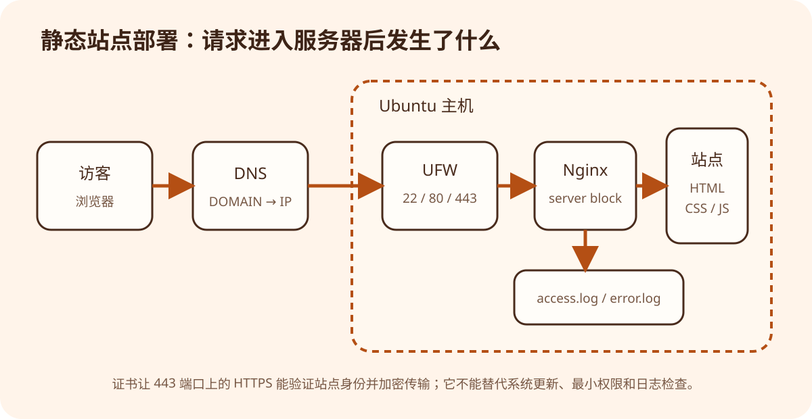

# 服务器：从网络请求到 Linux 部署

版本：v1.0.0
适用对象：理解基本网页概念、第一次接触 Linux 服务器的读者
示例环境：Windows 11 客户端、Ubuntu LTS 服务器、Nginx
最后核验：2026-09-21

> **验证边界**：本教程的配置依据 Ubuntu、Nginx 与 Certbot 官方资料编写，但没有在真实公网主机、域名和防火墙上执行。当前环境也没有安装 Nginx。所有服务器命令都必须在你自己的 Ubuntu 主机上逐步验证；不要把示例当成已经成功的运行记录。

## 学习目标

完成本教程后，你应该能够：

1. 区分服务器、云服务器、Web 服务器、进程和端口；
2. 解释 DNS、HTTP、HTTPS、正向代理和反向代理；
3. 使用 SSH 密钥连接 Ubuntu，并理解普通用户与 `sudo`；
4. 用 UFW 只开放必要端口；
5. 用 Nginx 发布 Hugo 静态文件；
6. 在域名解析生效后通过 Certbot配置 HTTPS；
7. 根据状态、日志和网络请求定位部署问题。

## 一、先建立正确的服务器概念

### 1.1 服务器既可以指机器，也可以指程序

日常交流中的“服务器”可能有两种含义：

- **服务器主机**：一台持续联网、运行 Linux 的计算机或虚拟机；
- **服务器程序**：等待请求并提供服务的进程，例如 Nginx、数据库或后端 API。

云服务器通常是云平台提供的虚拟机。买到云服务器并不等于网站已经上线：你仍要配置账号、网络规则、Web 服务器、站点文件、域名、证书、更新和备份。

### 1.2 IP、端口与进程

IP 地址帮助网络找到主机，端口帮助操作系统把连接交给正确进程。常见端口包括：

| 端口 | 常见用途 | 是否应对公网开放 |
| --- | --- | --- |
| 22/TCP | SSH 远程管理 | 需要管理时开放，最好限制来源并使用密钥 |
| 80/TCP | HTTP | 公开网站需要，也常用于证书验证和跳转 |
| 443/TCP | HTTPS | 生产网站通常需要 |
| 3000、8000 | 开发服务器 | 通常只绑定本机，不直接暴露公网 |
| 5432、3306 | PostgreSQL、MySQL | 除非架构明确要求，否则不要直接暴露公网 |

“程序启动了”和“公网能访问”是两件事。还要检查程序监听地址、主机防火墙、云平台安全组、DNS 和上游网络。

### 1.3 DNS 与域名

DNS 把 `DOMAIN` 解析为服务器 IP。部署单台 IPv4 服务器时，常见做法是创建 A 记录：

```text
名称：notes（或 @）
类型：A
值：SERVER_IP
```

若服务器配置了可用 IPv6，再添加 AAAA 记录。不要仅因为控制台允许填写就添加错误 IPv6；客户端可能优先尝试它，导致部分用户无法访问。

DNS 有缓存和 TTL，修改不会在所有位置瞬间生效。可在 Windows 查询：

```powershell
# 运行环境：Windows PowerShell 7；只读查询
Resolve-DnsName DOMAIN
```

在 Ubuntu 查询：

```bash
# 运行环境：Ubuntu Bash；只读查询
getent ahosts DOMAIN
```

只有返回预期地址，才进入证书签发步骤。

## 二、HTTP、HTTPS 与代理

### 2.1 HTTP 是请求与响应协议

浏览器可能发送：

```http
GET /posts/ HTTP/1.1
Host: DOMAIN
Accept: text/html
```

服务器返回状态行、响应头和正文。Nginx 可以直接从磁盘读取 HTML，也可以把请求转发给后端程序。

### 2.2 HTTPS 增加什么

HTTPS 是在 TLS 安全连接中传输 HTTP，主要提供：

- **机密性**：旁观者不能直接读出传输内容；
- **完整性**：传输内容不容易被悄悄篡改；
- **身份验证**：浏览器依据受信任证书确认访问的域名。

证书不能修复弱密码、过期系统、错误权限或应用漏洞。它只是分层安全中的一层。

### 2.3 正向代理与反向代理

二者都“代替一方与另一方通信”，但站的位置不同：

- **正向代理**代表客户端访问外部服务，外部服务看到的主要是代理；
- **反向代理**代表服务端接收请求，再转给内部应用，用户通常只看到统一域名。

Nginx 既能直接提供静态文件，也常用作反向代理。例如把公网的 `/api/` 请求转发给只监听 `127.0.0.1:8000` 的应用。本文部署静态 Hugo 站点，因此不需要后端进程。

## 三、部署拓扑与占位符



*图 1：UFW 控制主机端口，Nginx 按域名选择 server block，再读取 Hugo 构建文件。云平台安全组是主机外的另一层，图中未展开。*

全文使用以下占位符：

| 占位符 | 含义 | 示例格式，不可直接照搬 |
| --- | --- | --- |
| `SERVER_IP` | 公网 IPv4 地址 | `203.0.113.10` |
| `DOMAIN` | 完整域名 | `notes.example.com` |
| `SSH_USER` | 日常管理用户 | `deploy` |
| `SITE_ROOT` | Nginx 站点根目录 | `/srv/tech-notes/current` |
| `LOCAL_PUBLIC` | Windows 本地 Hugo 输出 | `C:\path\to\public` |

文档示例地址 `203.0.113.0/24` 专门保留用于说明，不是你的服务器。执行命令前先替换占位符，并用 `Get-Location`、`pwd`、`whoami` 确认自己在哪里、以谁的身份操作。

## 四、第一次连接与 SSH 密钥

### 4.1 先确认云平台边界

创建主机时至少记录：Ubuntu 版本、公网地址、初始用户名、登录方式和安全组规则。不要在教程、Issue 或聊天记录中公开密码与私钥。

Windows 自带 OpenSSH 客户端。首次连接：

```powershell
# 运行环境：Windows PowerShell 7
ssh SSH_USER@SERVER_IP
```

首次看到主机指纹时，不要无条件输入 `yes`。应从云控制台或可信渠道核对指纹；否则可能连接到错误主机。

### 4.2 生成密钥

先检查是否已有密钥，避免覆盖：

```powershell
Get-ChildItem "$env:USERPROFILE\.ssh" -ErrorAction SilentlyContinue
```

若确实需要新密钥：

```powershell
# 会在用户 .ssh 目录创建密钥；设置可靠口令
ssh-keygen -t ed25519 -C "web-server-admin"
```

私钥通常是 `id_ed25519`，不能发送给服务器或他人；`.pub` 才是公钥。将公钥添加到服务器用户的 `~/.ssh/authorized_keys`。Windows 未必提供 `ssh-copy-id`，可以从云控制台添加，也可以在已登录会话中谨慎粘贴公钥。

完成后另开一个终端验证密钥登录。在验证成功以前，保持当前 SSH 会话，不要急着关闭密码登录或重启 SSH。

### 4.3 不要直接照抄“关闭密码登录”

SSH 配置错误会把你锁在服务器外。若需要加固，应使用 `/etc/ssh/sshd_config.d/` 中的独立片段，先阅读当前 Ubuntu OpenSSH 文档，再按顺序执行：

```bash
# 只检查配置语法，不应用更改
sudo sshd -t

# 查看服务状态
sudo systemctl status ssh --no-pager
```

只有 `sshd -t` 成功、密钥登录已在第二个会话验证、云控制台有救援入口时，才考虑重新加载服务。本文不提供“一键禁用密码”的命令，因为不同镜像、云初始化和配置优先级可能不同。

## 五、用户、更新和最小权限

日常部署不应长期直接使用 `root`。Ubuntu 安装时创建的初始用户通常可通过 `sudo` 临时获得管理权限。

先做只读检查：

```bash
whoami
id
lsb_release -a
sudo -l
```

更新软件索引与已安装包会改变系统状态，安排维护窗口后执行：

```bash
sudo apt update
sudo apt upgrade
```

不要在不了解影响时加 `-y` 自动确认。升级内核或关键服务后可能需要重启；先看提示、确认当前业务和回退能力。

最小权限原则包括：

- 只给需要的账号 SSH 权限；
- 应用文件由适当用户维护，Nginx 只需读取；
- 不把数据库、开发服务器和管理面板随意暴露公网；
- 不把私钥、云 API Token 或备份放进站点根目录；
- 定期安装安全更新，并确认更新是否真正生效。

## 六、配置 UFW 防火墙

Ubuntu 常用 UFW 管理主机防火墙。启用前最重要的一步是保留 SSH 访问。

先检查云安全组和当前状态：

```bash
# 只读
sudo ufw status verbose
sudo ufw app list
sudo ss -lntp
```

用 dry-run 查看将产生的规则：

```bash
sudo ufw --dry-run allow OpenSSH
```

确认无误后，下面命令会修改防火墙：

```bash
# 先允许 SSH，避免启用防火墙后失联
sudo ufw allow OpenSSH

# 启用防火墙；保持当前 SSH 会话并另开会话验证
sudo ufw enable
sudo ufw status numbered
```

此时只放行了 SSH。云安全组和 UFW 都可能拦截连接，排错时要分别检查，不能只看其中一层。安装 Nginx 后再开放 HTTP/HTTPS。

## 七、安装并检查 Nginx

下面命令会安装软件并启动服务：

```bash
sudo apt update
sudo apt install nginx
```

确认安装产生了 Nginx 应用配置后，再开放 HTTP 与 HTTPS：

```bash
sudo ufw app list
sudo ufw --dry-run allow 'Nginx Full'
sudo ufw allow 'Nginx Full'
sudo ufw status verbose
```

安装后先在服务器内部检查：

```bash
systemctl status nginx --no-pager
curl -I http://127.0.0.1/
sudo ss -lntp | grep ':80'
```

预期能看到 Nginx 运行、HTTP 响应以及 80 端口监听。随后从 Windows 检查：

```powershell
curl.exe -I http://SERVER_IP/
```

如果本机成功、公网失败，重点检查 UFW、安全组和公网地址；如果本机也失败，先看 Nginx 状态与日志。

## 八、构建和上传 Hugo 站点

### 8.1 在本地构建

不要把 Hugo 源文件全扔给 Nginx。先在 Windows 构建：

```powershell
Set-Location ".\examples\hugo-tech-notes"
hugo --minify --cleanDestinationDir --baseURL "https://DOMAIN/"
```

检查 `public/index.html`。生产 `baseURL` 必须与最终 HTTPS 地址一致。

### 8.2 在服务器准备目录

本教程使用 `/srv/tech-notes/current`。创建目录会修改服务器：

```bash
sudo mkdir -p /srv/tech-notes/current
sudo chown -R SSH_USER:SSH_USER /srv/tech-notes
sudo chmod -R u=rwX,go=rX /srv/tech-notes
```

这里让部署用户拥有写权限，其他用户只有读取和进入目录的权限。不要机械使用 `chmod -R 777`；它把问题掩盖成过度授权。

### 8.3 上传文件

在 Windows 的 `hugo-tech-notes` 目录执行：

```powershell
# 把 public 目录中的内容递归上传到站点根目录
scp -r ".\public\*" "SSH_USER@SERVER_IP:/srv/tech-notes/current/"
```

PowerShell 的通配符与隐藏文件行为可能随工具而异。上传后必须在服务器核对：

```bash
find /srv/tech-notes/current -maxdepth 2 -type f | sort | head -50
test -f /srv/tech-notes/current/index.html && echo 'index exists'
```

更成熟的发布应使用版本目录、原子软链接切换和保留上一版，以便回退；本教程先建立最小流程，不把简单复制包装成零停机发布。

## 九、配置 Nginx 站点

配套配置在 [`example/nginx-site.conf`](example/nginx-site.conf)。先在本地阅读，再把 `DOMAIN` 与 `SITE_ROOT` 替换为实际值。

在服务器备份已有配置：

```bash
sudo cp /etc/nginx/sites-available/default /etc/nginx/sites-available/default.backup
```

将配置保存到 `/etc/nginx/sites-available/DOMAIN`，并把：

```nginx
server_name DOMAIN;
root SITE_ROOT;
```

替换为真实值。启用站点：

```bash
# 会创建符号链接；若目标已存在，先检查而不是强制覆盖
sudo ln -s /etc/nginx/sites-available/DOMAIN /etc/nginx/sites-enabled/DOMAIN
```

最关键的门禁：

```bash
sudo nginx -t
```

只有看到配置语法和测试成功，才重载：

```bash
sudo systemctl reload nginx
curl -I -H "Host: DOMAIN" http://127.0.0.1/
```

如果新站点正常，再评估是否删除默认站点的软链接。不要直接删除原配置文件；保留可恢复副本。

## 十、域名与 HTTPS

### 10.1 证书签发前检查

Certbot 的 Nginx 插件需要找到匹配域名的 server block，ACME 验证还要求域名正确指向服务器并可从公网访问。逐项确认：

```powershell
# Windows：DNS 应返回 SERVER_IP
Resolve-DnsName DOMAIN
curl.exe -I http://DOMAIN/
```

服务器上确认：

```bash
sudo nginx -t
sudo ufw status verbose
curl -I -H "Host: DOMAIN" http://127.0.0.1/
```

### 10.2 使用当前官方说明安装 Certbot

Certbot 安装方式会变化，必须在执行当天打开 [Certbot Instructions](https://certbot.eff.org/instructions) 或 Ubuntu 的 TLS 证书文档，选择 **Nginx + 当前 Ubuntu 版本**。不要从多年以前的博客复制安装命令。

安装完成后，常见签发方式是：

```bash
# 会申请证书并修改匹配的 Nginx 配置
sudo certbot --nginx -d DOMAIN
```

该命令会改变 Nginx 配置。执行前先备份 `/etc/nginx` 中的站点配置，并确认 `DOMAIN` 真实可控。签发后验证：

```bash
sudo nginx -t
sudo systemctl status nginx --no-pager
sudo certbot renew --dry-run
curl -I https://DOMAIN/
```

浏览器出现锁图标只是基础现象；还要检查证书域名、有效期、HTTP 到 HTTPS 跳转和实际内容。

## 十一、日志驱动的排错方法

### 11.1 四层定位

按从近到远的顺序检查：

1. **进程层**：Nginx 是否运行，配置能否通过 `nginx -t`？
2. **主机层**：是否监听端口，UFW 是否允许？
3. **公网层**：云安全组和路由是否允许，IP 是否正确？
4. **域名与 TLS 层**：DNS 是否指向该主机，证书是否匹配？

常用只读命令：

```bash
systemctl status nginx --no-pager
sudo journalctl -u nginx --since "30 minutes ago" --no-pager
sudo tail -n 100 /var/log/nginx/tech-notes.error.log
sudo tail -n 100 /var/log/nginx/tech-notes.access.log
sudo ss -lntp
curl -vI http://127.0.0.1/
```

### 11.2 常见症状

| 症状 | 优先检查 |
| --- | --- |
| `Connection timed out` | 安全组、UFW、错误 IP、路由 |
| `Connection refused` | 服务未监听、监听地址或端口错误 |
| Nginx 默认页 | `server_name` 未匹配、默认站点仍接管请求 |
| `403 Forbidden` | 目录权限、文件权限、站点根路径、日志 |
| `404 Not Found` | 上传目录、URL 路径、`try_files`、大小写 |
| HTTPS 证书不匹配 | DNS、Certbot `-d` 域名、错误 server block |
| 样式仍是旧版 | 浏览器/CDN 缓存、上传遗漏、错误站点根目录 |

不要一次修改多处。先保存日志和命令输出，只改变一个假设，再重复验证。

## 十二、发布、回退与维护

### 12.1 发布前后

发布前：

- 在本地完成 Hugo 构建和页面检查；
- 备份当前 Nginx 配置与站点版本；
- 确认磁盘空间、域名和目标目录；
- 记录本次构建来源，例如 Git 提交号。

发布后：

- 从服务器内部和外部各请求一次；
- 打开首页、文章列表和一篇详情页；
- 检查错误日志与证书；
- 确认旧版本仍能恢复。

### 12.2 一个更安全的目录思路

```text
/srv/tech-notes/
├─ releases/
│  ├─ 20260921-100000/
│  └─ 20260922-093000/
└─ current -> releases/20260922-093000/
```

上传到新版本目录、检查完整性后，再切换 `current` 软链接。回退时把链接指回上一版本。真正的原子发布还要处理权限、并发、清理策略和自动化失败；这属于进阶内容。

### 12.3 持续维护

- 安装安全更新并处理需要重启的情况；
- 监控磁盘、内存、证书续期和错误率；
- 定期验证备份能够恢复，而不是只确认备份文件存在；
- 删除不用的账号、端口和服务；
- 对配置变更保留版本记录和回退步骤。

## 十三、GitHub Pages 还是自有服务器

| 需求 | GitHub Pages | 自有 Ubuntu + Nginx |
| --- | --- | --- |
| 静态站点 | 很适合 | 适合 |
| 服务器维护 | 平台负责 | 自己负责 |
| 自定义 Nginx/系统服务 | 不支持 | 支持 |
| 后端进程与数据库 | 不直接支持 | 可以，但维护成本更高 |
| 学习运维 | 较少 | 完整 |
| 攻击面与责任 | 相对较小 | 账号、更新、端口、日志、备份均需负责 |

若目标只是公开 Hugo 文档，Pages 通常更省心。选择 VPS 应源于明确需求，而不是认为“自己有服务器才算真正的网站”。

## 十四、练习

1. 画出浏览器、DNS、云安全组、UFW、Nginx 和站点目录之间的路径。
2. 用 `curl -I` 对比请求 IP 与请求域名时的响应，解释 `Host` 的作用。
3. 阅读配套 Nginx 配置，指出每条 `location` 的匹配对象。
4. 写一份发布检查清单，其中必须包含备份、验证与回退。
5. 假设出现 403，列出三个可能原因及对应的只读检查命令。

## 十五、上线检查清单

- [ ] DNS 的 A/AAAA 记录与真实网络配置一致。
- [ ] SSH 密钥登录已在第二个会话验证，私钥未上传或泄露。
- [ ] UFW 与云安全组只开放必要端口。
- [ ] `nginx -t` 成功，Nginx 服务状态正常。
- [ ] `SITE_ROOT` 中包含最新 `index.html`，权限允许 Nginx 读取。
- [ ] HTTP 能访问后再申请证书，HTTPS 与续期 dry-run 均成功。
- [ ] 内部、外部、域名和 HTTPS 四条访问路径均验证。
- [ ] 日志中没有持续错误，旧版本与配置可以恢复。
- [ ] 没有把密钥、Token、备份或配置副本暴露在站点目录。

## 十六、小结

把网站放上服务器不是一条神秘命令，而是一条可以逐层验证的链路：DNS 找到主机，安全组和防火墙允许连接，Nginx 监听端口并匹配域名，再从正确目录读取 Hugo 生成的文件。HTTPS 在此基础上增加身份验证与传输保护。

可靠运维的关键不是记住所有命令，而是每次操作前知道它会改变什么、如何检查、失败后怎样恢复。

## 参考资料

- [Ubuntu Server：OpenSSH server](https://ubuntu.com/server/docs/how-to/security/openssh-server/)
- [Ubuntu Server：Firewall](https://documentation.ubuntu.com/server/how-to/security/firewalls/)
- [Ubuntu Server：How to configure Nginx](https://ubuntu.com/server/docs/how-to/web-services/configure-nginx/)
- [Ubuntu Server：Obtain TLS certificates](https://ubuntu.com/server/docs/how-to/security/obtain-tls-certificates/)
- [Ubuntu Server：Automatic updates](https://ubuntu.com/server/docs/how-to/software/automatic-updates/)
- [Nginx：Beginner's Guide](https://nginx.org/en/docs/beginners_guide.html)
- [Certbot：Instructions](https://certbot.eff.org/instructions)
- [Hugo：Basic usage](https://gohugo.io/getting-started/usage/)

以上官方资料最后核验于 2026-09-21。Certbot 的安装命令与支持系统变化较快，实操当天必须再次核对。
