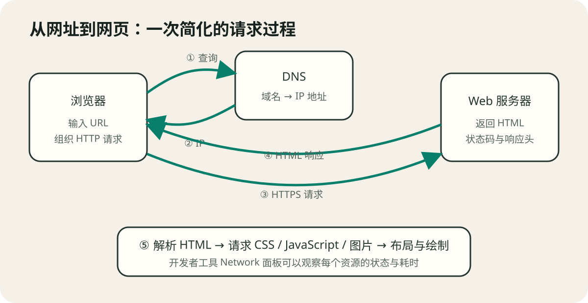
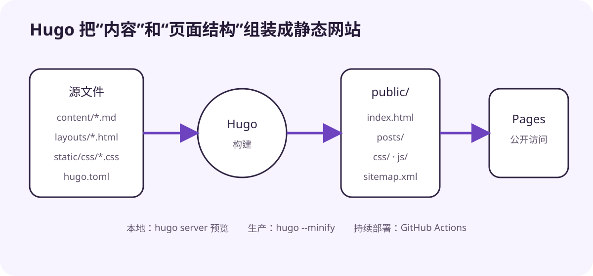

# Web 开发：从网页到 Hugo 网站

版本：v1.0.0
适用对象：第一次系统学习 Web 开发的读者
本地环境：Windows 11、PowerShell 7、Git、Hugo Extended
最后核验：2026-09-21

## 学习目标

完成本教程后，你应该能够：

1. 解释网页、网站、浏览器、前端、后端和服务器之间的关系；
2. 看懂 URL，并描述一次网页请求的大致过程；
3. 理解 HTML、CSS、JavaScript 各自负责什么；
4. 在本地运行并修改一个完整的 Hugo 静态网站；
5. 构建生产文件，并理解 GitHub Pages 自动部署流程；
6. 使用浏览器开发者工具排查常见问题。

配套项目位于 [`example/hugo-tech-notes/`](example/hugo-tech-notes/)。教程中的操作只修改这个示例目录，不要求改动任何现有项目。

## 一、网页、网站与 Web 开发

### 1.1 网页不是“浏览器里的截图”

网页通常是一份 HTML 文档。HTML 描述标题、段落、链接、图片、导航等结构；浏览器读取文档后，把它排版并绘制到屏幕上。CSS 改变颜色、间距和布局，JavaScript 让页面响应点击、输入或网络数据。

**网站**是一组通过链接和共同导航组织起来的网页及相关资源。例如，一个技术博客可能包含首页、文章列表、每篇文章的详情页、CSS、JavaScript 和图片。浏览器一次只能显示某个页面，但这些页面共同组成网站。

容易混淆的几个词：

| 词语 | 主要职责 | 示例 |
| --- | --- | --- |
| 浏览器 | 请求资源、解释 HTML/CSS/JS、绘制页面 | Chrome、Firefox、Edge |
| 前端 | 直接运行或呈现在浏览器中的界面 | HTML、CSS、JavaScript |
| 后端 | 在服务器上处理业务、权限和数据 | Python、Java、Go、Node.js 服务 |
| 数据库 | 持久保存并查询结构化数据 | PostgreSQL、MySQL |
| Web 服务器 | 接收 HTTP 请求并返回文件或转发请求 | Nginx、Apache |
| 静态网站生成器 | 构建时把内容和模板生成 HTML | Hugo |

本教程的示例是**静态网站**：访问者请求时，服务器直接返回已经生成好的 HTML、CSS 和 JavaScript，不需要每次查询数据库再拼页面。静态不等于没有交互；浏览器端 JavaScript 仍可以切换主题、过滤内容或请求外部 API。

### 1.2 Web 开发不只是写页面

一个可交付的网站至少要同时回答这些问题：

- 内容是否清楚，HTML 结构是否有语义？
- 小屏幕、键盘操作和辅助技术能否使用？
- 文件如何组织、构建和版本控制？
- 地址、缓存、错误页面和搜索引擎信息是否合理？
- 怎样部署，出错时去哪里看日志？

因此，“会写一个漂亮页面”和“能维护一个网站”不是同一件事。本教程先把最小闭环走通，再逐步增加复杂度。

## 二、输入网址后发生了什么



*图 1：浏览器先找到服务器，再请求 HTML 和页面依赖的其他资源。图中省略了缓存、CDN、TLS 握手等细节。*

假设访问：

```text
https://notes.example.com/posts/http/?from=course#dns
```

它可以拆成：

| 部分 | 示例 | 作用 |
| --- | --- | --- |
| 协议 | `https` | 约定通信方式，并通过 TLS 加密与验证身份 |
| 主机名 | `notes.example.com` | 通过 DNS 查找服务器地址 |
| 路径 | `/posts/http/` | 指向站点中的资源 |
| 查询参数 | `?from=course` | 向服务端或前端传递附加参数 |
| 片段 | `#dns` | 定位页面内部位置，通常不发送给服务器 |

一次简化请求包括：

1. 浏览器检查本地缓存，并通过 DNS 查询主机名对应的 IP 地址；
2. 浏览器与服务器建立网络连接；HTTPS 还要建立 TLS 安全连接；
3. 浏览器发送 HTTP 请求，例如 `GET /posts/http/`；
4. 服务器返回状态码、响应头和 HTML；
5. 浏览器解析 HTML，继续请求其中引用的 CSS、JavaScript、字体和图片；
6. 浏览器构建页面结构，计算布局并绘制到屏幕上。

常见状态码：

- `200 OK`：请求成功；
- `301`、`308`：资源永久移动，浏览器应访问新地址；
- `403 Forbidden`：服务器理解请求，但拒绝访问；
- `404 Not Found`：资源不存在，常见于路径或大小写错误；
- `500 Internal Server Error`：服务器执行时发生错误。

状态码只能说明这一层的结果。首页返回 200，不代表页面引用的 CSS 也一定成功；所以排错时要观察每个请求。

## 三、HTML、CSS 与 JavaScript

### 3.1 HTML：描述结构与含义

```html
<!doctype html>
<html lang="zh-CN">
  <head>
    <meta charset="utf-8">
    <meta name="viewport" content="width=device-width, initial-scale=1">
    <title>技术手记</title>
  </head>
  <body>
    <header>
      <nav aria-label="主导航">
        <a href="/">首页</a>
        <a href="/posts/">文章</a>
      </nav>
    </header>
    <main>
      <article>
        <h1>第一篇技术笔记</h1>
        <p>从语义清楚的结构开始。</p>
      </article>
    </main>
  </body>
</html>
```

`header`、`nav`、`main`、`article` 不是为了“看起来高级”，而是告诉浏览器、搜索引擎和辅助技术每块内容的角色。标题也应按层级组织：页面主标题通常是一个 `h1`，其下再使用 `h2`、`h3`，不要只因为字号需要就跳级。

### 3.2 CSS：控制呈现与布局

```css
:root {
  --background: #f7f4ec;
  --text: #17211d;
  --accent: #006d5b;
}

body {
  margin: 0;
  background: var(--background);
  color: var(--text);
  font-family: system-ui, sans-serif;
}

.card-grid {
  display: grid;
  grid-template-columns: repeat(3, 1fr);
  gap: 1rem;
}

@media (max-width: 720px) {
  .card-grid { grid-template-columns: 1fr; }
}
```

响应式设计不是把桌面页面整体缩小，而是让内容在不同空间重新排布。示例在宽屏显示三列，窄屏改成一列。还应尽量使用弹性宽度、合适的行长和清晰的焦点样式。

### 3.3 JavaScript：响应事件和改变状态

```javascript
const button = document.querySelector('.theme-toggle');

button?.addEventListener('click', () => {
  document.documentElement.dataset.theme = 'dark';
});
```

这段代码寻找按钮，监听点击，再改变根元素的属性。CSS 可以根据这个属性应用深色主题。`?.` 表示按钮不存在时不继续调用，避免简单页面直接报错。

JavaScript 能增强体验，但不应破坏基本访问路径。例如导航最好仍然使用 `<a href="...">`，而不是只有执行 JavaScript 才能跳转。

## 四、为什么在这里使用 Hugo

纯手写两个页面很容易；写五十篇文章时，手动复制导航、页脚和 `<head>` 就会造成重复和不一致。Hugo 把三类材料组合起来：

- `content/`：Markdown 内容和 Front Matter 元数据；
- `layouts/`：把内容放到 HTML 结构中的模板；
- `static/`：直接复制的 CSS、JavaScript 和图片；
- `hugo.toml`：站点标题、地址、语言等配置。



*图 2：开发时 Hugo 提供本地预览；发布时生成可直接托管的 `public/`。*

Hugo 在构建阶段完成模板渲染，不要求生产服务器运行 Hugo。这让静态站点易于部署，也减少了服务器运行时组件。但登录、订单、私有数据等动态业务仍需要后端或外部服务。

## 五、运行配套网站

### 5.1 安装并检查 Hugo

Hugo 官方在 Windows 上提供 Winget 包。下面的命令会在系统中安装软件，执行前先确认你允许本机安装：

```powershell
# 运行环境：Windows PowerShell 7；会修改本机软件安装状态
winget install Hugo.Hugo.Extended
```

关闭并重新打开 PowerShell，然后检查：

```powershell
hugo version
git --version
```

教程验证使用 Hugo Extended 0.166.0。若版本不同，先阅读 Hugo 发布说明；不要看到命令成功就假定输出完全相同。

### 5.2 启动本地开发服务器

在本资料包根目录运行：

```powershell
# 运行环境：Windows PowerShell 7
Set-Location ".\examples\hugo-tech-notes"
hugo server -D
```

终端会显示本地地址，通常是 `http://localhost:1313/`。浏览器打开后应看到“技术手记”首页和两篇示例文章。`-D` 表示预览标记为草稿的内容；生产构建默认不发布草稿。

按 `Ctrl+C` 停止服务器。

### 5.3 认识项目结构

```text
hugo-tech-notes/
├─ content/
│  ├─ _index.md
│  └─ posts/
│     ├─ _index.md
│     ├─ first-note.md
│     └─ http-notes.md
├─ layouts/
│  ├─ baseof.html
│  ├─ home.html
│  ├─ list.html
│  └─ single.html
├─ static/
│  ├─ css/main.css
│  └─ js/main.js
├─ .github/workflows/hugo.yaml
└─ hugo.toml
```

`baseof.html` 是公共外壳；`home.html`、`list.html` 和 `single.html` 分别负责首页、列表页和单篇内容。模板中的 `{{ ... }}` 是 Hugo 模板表达式，例如 `{{ .Title }}` 读取当前页面标题。

### 5.4 新增一篇文章

复制已有文章最直观，也可以使用 Hugo 命令。为了避免覆盖现有文件，先检查目标：

```powershell
Test-Path ".\content\posts\my-web-note.md"
```

结果应为 `False`。然后创建内容骨架：

```powershell
hugo new content posts/my-web-note.md
```

打开文件，填写：

```markdown
---
title: "我的 Web 学习记录"
date: 2026-09-21T10:00:00+08:00
description: "记录第一次运行 Hugo 网站。"
tags: [Web, Hugo]
draft: true
---

## 我完成了什么

我能够在本地启动 Hugo，并通过浏览器访问站点。
```

保持 `hugo server -D` 运行，保存后浏览器会刷新。准备发布时把 `draft` 改为 `false`。

### 5.5 构建生产文件

```powershell
hugo --minify --cleanDestinationDir
```

- `--minify` 压缩可压缩输出；
- `--cleanDestinationDir` 清理目标目录中不再由当前构建生成的文件；
- 结果写入 `public/`。

检查关键页面：

```powershell
Test-Path ".\public\index.html"
Test-Path ".\public\posts\index.html"
Get-ChildItem ".\public\posts" -Recurse -Filter index.html
```

这里的 `public/` 是生成物，不是内容源。修改它会在下次构建时丢失，因此 `.gitignore` 已将其排除。

## 六、部署到 GitHub Pages

### 6.1 发布前替换占位符

`hugo.toml` 中的地址是：

```toml
baseURL = 'https://GITHUB_USER.github.io/REPOSITORY/'
```

把 `GITHUB_USER` 和 `REPOSITORY` 替换为实际 GitHub 用户名与仓库名。项目站点通常位于 `https://用户名.github.io/仓库名/`，组织或用户主页仓库的规则不同，必须以 GitHub Pages 当前文档为准。

### 6.2 初始化并推送仓库

以下命令会创建本地 Git 历史并准备远程推送。把远程地址替换后再执行：

```powershell
git init
git add .
git status
git commit -m "Create Hugo technical notes site"
git branch -M main
git remote add origin https://github.com/GITHUB_USER/REPOSITORY.git
git push -u origin main
```

`git status` 是必要检查，不是装饰。它让你在提交前确认没有密钥、`public/` 或无关文件。

### 6.3 理解工作流

`.github/workflows/hugo.yaml` 在推送 `main` 时执行：

1. 安装固定版本 Hugo；
2. 检出仓库；
3. 由 `configure-pages` 取得正确的 Pages 基础地址；
4. 构建 `public/`；
5. 上传 Pages artifact；
6. 部署到 `github-pages` 环境。

工作流显式申请 `contents: read`、`pages: write` 和 `id-token: write`，没有授予不需要的仓库写权限。

在 GitHub 仓库打开 `Settings → Pages`，把发布源设为 **GitHub Actions**。再到 `Actions` 查看构建与部署日志。只有工作流成功，并且实际页面能访问，才算完成线上部署。

## 七、用开发者工具排错

按 `F12` 或浏览器菜单打开开发者工具：

- **Elements / Inspector**：查看实际 DOM 和最终生效的 CSS；
- **Console**：查看 JavaScript 错误和主动输出；
- **Network**：查看每个请求的 URL、状态码、类型和耗时；
- **Lighthouse / Performance**：辅助发现性能与可访问性问题，但分数不是唯一目标。

建议按证据排查：

1. 终端中 Hugo 是否报告模板或 Front Matter 错误？
2. Network 中失败的是 HTML、CSS、JavaScript 还是图片？
3. 失败请求的完整 URL 是否包含正确的仓库子路径？
4. Console 是否有脚本语法错误？
5. Elements 中元素是否存在，只是被 CSS 隐藏或覆盖？

## 八、可访问性、SEO、性能与缓存

### 8.1 可访问性

- 使用 `header`、`nav`、`main`、`article` 等语义元素；
- 图片提供与用途相符的 `alt`，纯装饰图使用空 `alt`；
- 链接文字说明去向，不要大量使用“点击这里”；
- 所有操作可用键盘完成，并保留清晰焦点；
- 不只依赖颜色传达错误或状态；
- 尊重 `prefers-reduced-motion`，避免强制动画。

配套站点包含“跳到正文”链接、导航标签、按钮状态和减少动画设置，可以在源码中逐一寻找。

### 8.2 SEO

搜索引擎优化的基础不是堆关键词，而是让页面能被正确理解：独立标题、准确摘要、清楚的标题层级、稳定链接、站点地图和可抓取内容。Hugo 会根据内容生成 `sitemap.xml`；仍需保证正文真正回答读者问题。

### 8.3 性能与缓存

- 压缩图片，优先使用合适尺寸和现代格式；
- 避免为了一个小功能加载庞大脚本；
- CSS 和 JavaScript 若长期缓存，最好使用内容哈希文件名；
- HTML 更新频繁，不宜盲目设置极长缓存；
- 用 Network 面板测量真实请求，不凭文件数量猜性能。

## 九、常见错误

### 9.1 本地正常，Pages 样式丢失

常见原因是把资源写成 `/css/main.css`，部署到项目子路径后它会指向域名根目录。示例使用 Hugo 的 `relURL`：

```go-html-template
{{ "css/main.css" | relURL }}
```

同时在工作流构建时使用 Pages 返回的基础地址。

### 9.2 修改 `public/` 后又消失

`public/` 是输出。应修改 `content/`、`layouts/` 或 `static/`，再重新构建。

### 9.3 新文章本地看不到

检查文件是否在 `content/`、Front Matter 是否闭合、`draft` 是否为 `true`。草稿需要 `hugo server -D` 才显示。

### 9.4 页面能打开但 JavaScript 没反应

先看 Console，再确认脚本是否在 Network 中成功加载、选择器是否匹配、代码是否等 DOM 加载后执行。示例通过 `defer` 加载脚本。

### 9.5 自动部署失败

先阅读失败步骤的日志，不要反复重跑掩盖原因。检查 Pages 发布源、工作流权限、Hugo 版本、配置语法和基础地址。不要把失败简单归因于“GitHub 有问题”。

## 十、练习

1. 新增一篇非草稿文章，为它添加两个标签，并在列表页找到它。
2. 给首页增加“学习主题”区块，但保持移动端单列布局。
3. 故意把 CSS 路径改错，用 Network 面板记录状态码，再修复。
4. 关闭 JavaScript，确认导航和文章仍能访问；解释哪些功能消失。
5. 用键盘 `Tab` 遍历页面，修复任何看不清或到不了的交互元素。

## 十一、发布前检查清单

- [ ] `hugo --minify --cleanDestinationDir` 成功完成。
- [ ] 首页、文章列表和每篇详情页都能打开。
- [ ] 手机宽度下没有横向滚动或文字溢出。
- [ ] Network 中没有意外 404，Console 中没有未处理错误。
- [ ] 标题层级、链接文字、图片替代文字和键盘焦点合理。
- [ ] `baseURL`、仓库名和 Pages 发布源正确。
- [ ] Git 差异中没有 `public/`、密钥、令牌或本地绝对路径。
- [ ] Actions 成功后实际访问线上地址，而不是只看绿色图标。

## 十二、小结

Web 开发的主线可以概括为：浏览器通过 URL 和 HTTP 取得资源，HTML 负责结构，CSS 负责呈现，JavaScript 负责交互；Hugo 在构建阶段把重复的模板与独立内容组合为静态文件；GitHub Actions 再把这些文件部署到 Pages。

理解这条链路后，遇到错误就不必只靠刷新或重新复制代码。你可以判断问题发生在内容、模板、资源路径、构建还是部署阶段，并用终端日志与开发者工具验证判断。

## 参考资料

- [MDN：How the web works](https://developer.mozilla.org/en-US/docs/Learn_web_development/Getting_started/Web_standards/How_the_web_works)
- [MDN：Learn web development](https://developer.mozilla.org/en-US/docs/Learn_web_development)
- [MDN：What are browser developer tools?](https://developer.mozilla.org/en-US/docs/Learn_web_development/Howto/Tools_and_setup/What_are_browser_developer_tools)
- [Hugo：Windows 安装](https://gohugo.io/installation/windows/)
- [Hugo：Basic usage](https://gohugo.io/getting-started/usage/)
- [Hugo：Host on GitHub Pages](https://gohugo.io/host-and-deploy/host-on-github-pages/)
- [GitHub Docs：Using custom workflows with GitHub Pages](https://docs.github.com/en/pages/getting-started-with-github-pages/using-custom-workflows-with-github-pages)

以上官方资料最后核验于 2026-09-21。
